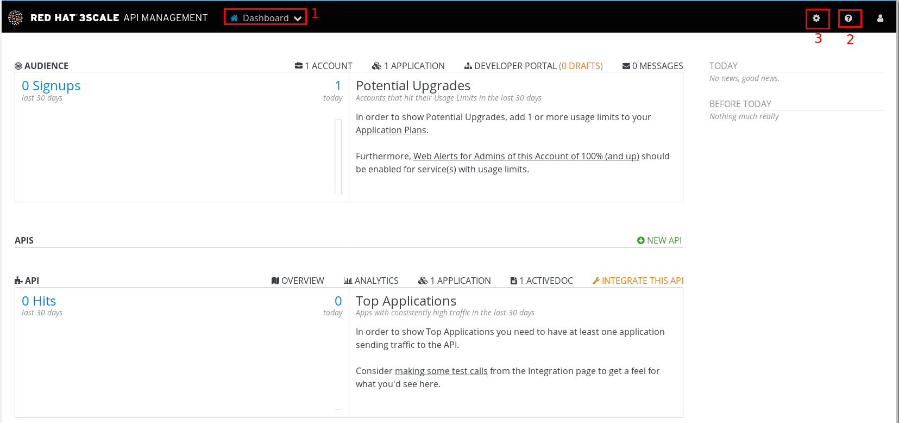
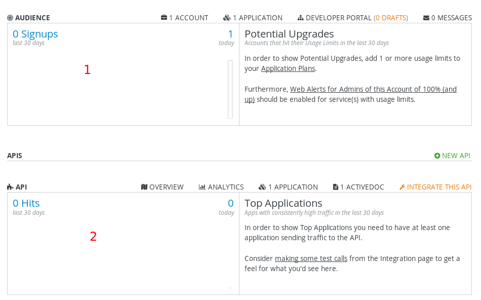
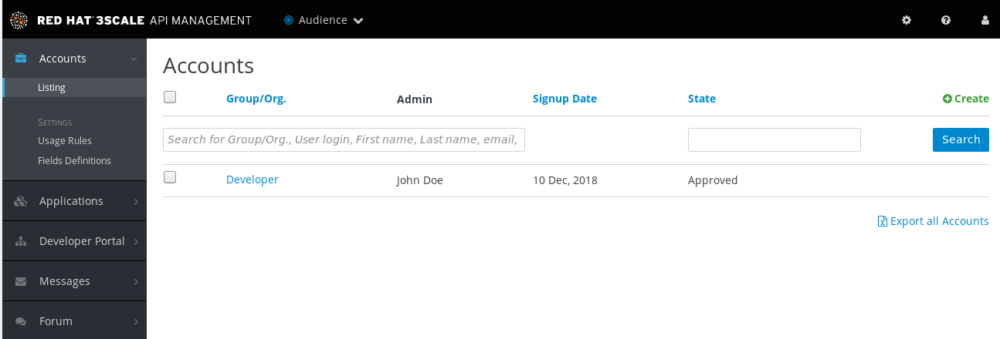
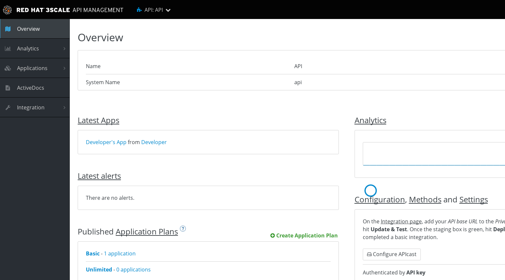

= 管理门户
:toc: manual

== 管理门户概述

3Scale 登录成功后首先会进入到管理门户，界面如下图所示：

* 1 标记处包括 Dashboard、Audience、API 三种视图，分别用于整体查看；管理用户及开发者，设置如何访问 API；管理 API。
* 2 标记处包括常用文档连接：Customer Portal、3scale platform API docs Liquid Tag reference，分别定向到产品文档；管理 REST API；及开发者门户编程语言。
* 3 标记处为帐号管理相关

== Dashboard 视图

Dashboard 视图包括一些 API 相关核心的统计数据。 

如上图，共有两个部分：

* Audience 相关，包括 Signups 总数，Potential Upgrades 等
* API 相关，包括访问量、Top Applications 等

== Audience 视图

Audience 视图的目的是将 API 对外暴露，使 API 可以被消费者消费。

Audience 视图主要包括：

* *用户管理* - 用户即是 API 消费者，用户列表、使用规则、用户信息定义没等
* *应用管理* - 第三方团队，用来认证连接 API
* *开发者门户* -  面向开发者的 CMS (Content Management System) 系统，用来开发一个 Web 门户，从而使开发者方面和 API 进行交互
* *支付管理* - 支付管理
* *消息管理* - 单个或批量管理开发者消息

== API 视图

API 视图是 3Scale 最重要的一个视图，它是将后台的服务和 API 管理的方案进行整合。

其中：

* *Analytics* - API 分析相关图形化工具
* *ActiveDocs* - API 文档，在线实时测试 API
* *Integration* - 配置集成后台API
