= API Design
:toc: manual

== 目的

本部分通过 `Apicurio` 进行 API 设计。

== 创建 API

*1. 登录 Apicurio，查看欢迎页面*

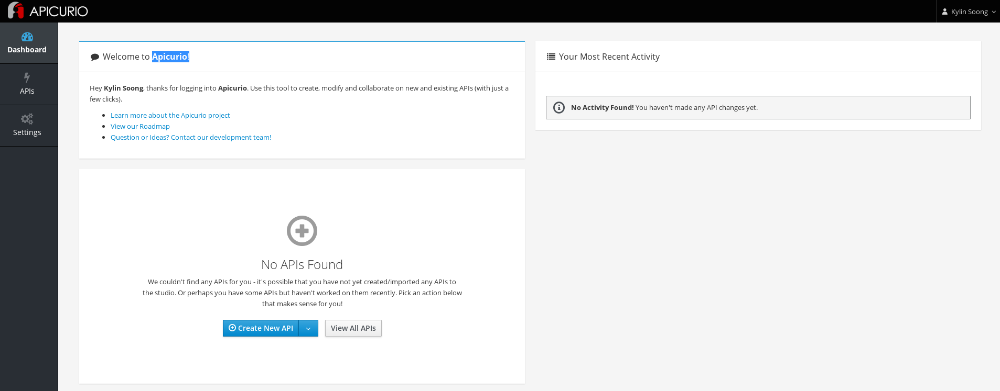

*2. 点击 APIs，进入到 Create New API*

image:img/design-03.png[]

*3. 在弹出的对话框中填入*

* Name: `Open API 3.0.2`
* Description: `Locations API`
* Type: `Open API 3.0.2`
* Template: `Blank API`

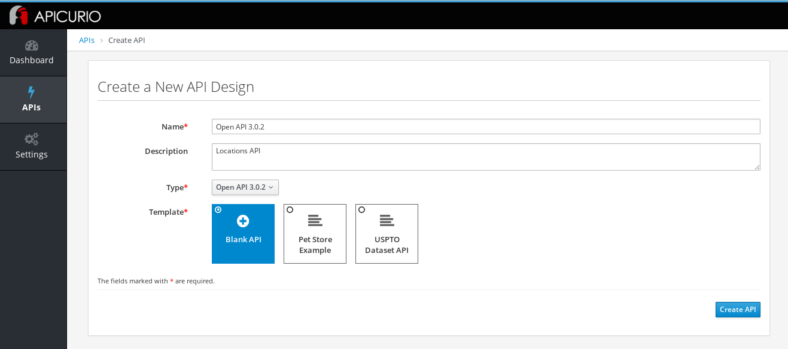

*4. 点击 Create API 后，点击 Edit API*

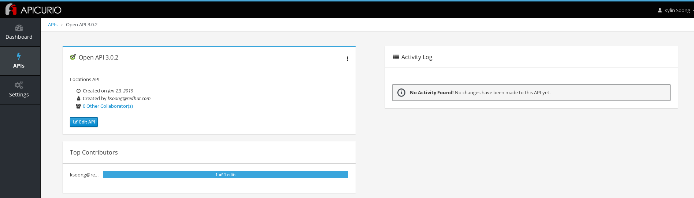

== 编辑 API

*1. 点击左边 Add a data type 链接*

*2. Name 部分输入值 location*

[source, json]
.*3. Enter JSON Example 部署输入*
----
{
    "id": 1,
    "name": "International Inc Corporate Office",
    "location": {
        "lat": 51.5013673,
        "lng": -0.1440787
    },
    "type": "headquarter",
    "status": "1"
}
----

*4. Choose to create a REST Resource with the Data Typ 部分选择 REST Resource*

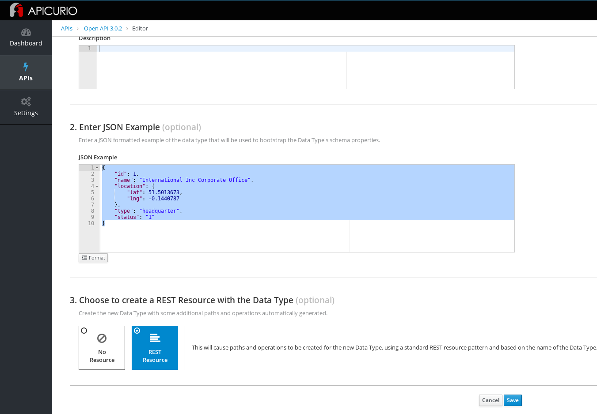

*5. 点击 Save，设计的 API 如下图所示*

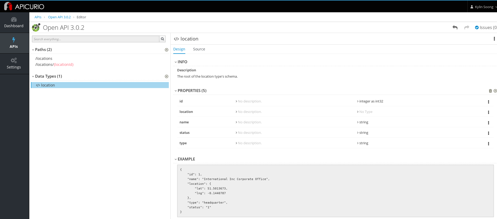

== 编辑方法

选择相应的 path，查看生成的方法，默认生成 GET 和 POST 方法，如下

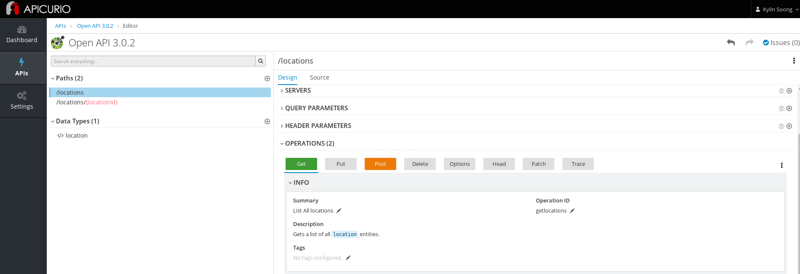

== 下载/推送到代码库

*1. 选择 Download (JSON)*

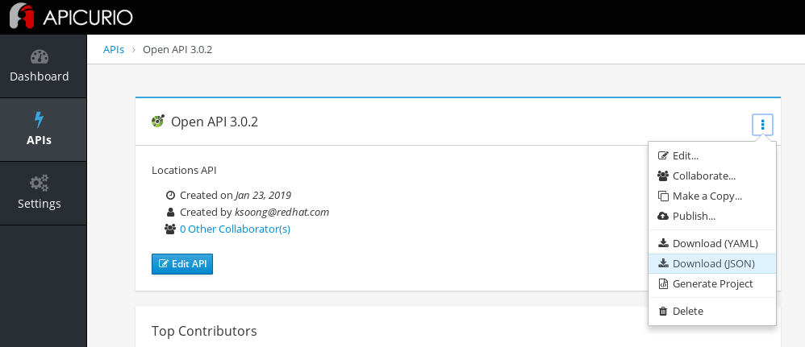

link:files/Open-API-3.0.2.json[Open API 3.0.2.json] 会下载到本地。

使用 JSON 编辑器格式化 JSON 文件，格式如下

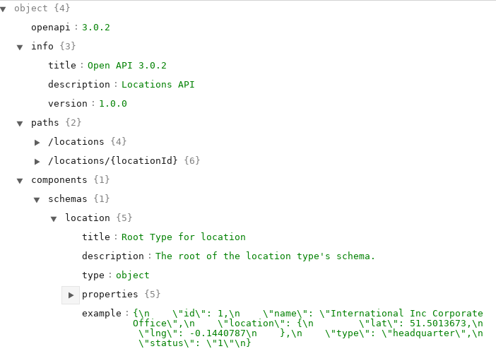

*2. 选择 Generate Project，在弹出 Project Generation Wizard 界面中 Select Type 部分使用默认值*

*3. 点击 Next，在 Configure Project 页面选择*

* Type: `Thorntail JAX-RS`
* Group ID: `org.example`
* Artifact ID: `locations`
* Java Package: `org.example.localtions`

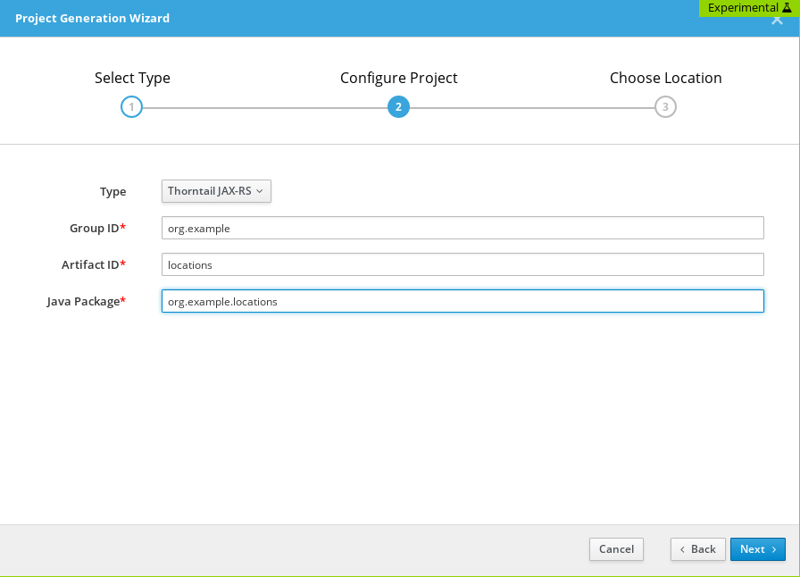

*4. 点击 Next，在 Choose Location 页面选择 Download result as ZIP*

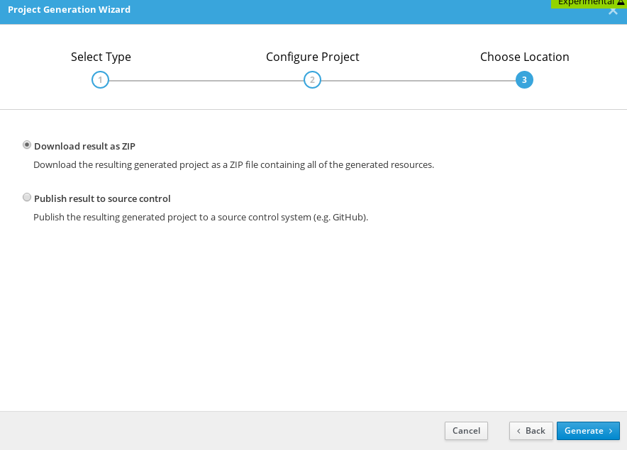

*5. 点击 Generate 生成 Project*

[source, java]
.*1. 解压下载的 zip 包*
----
$ unzip locations.zip -d locations
----

*2. 查看生成的代码结构*

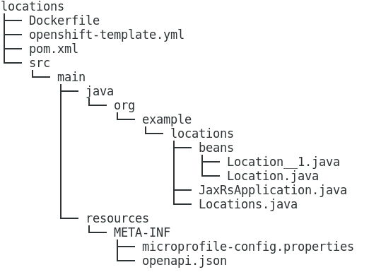

[source, java]
.*3. 查看生成的接口方法*
----
package org.example.locations;

import java.lang.String;
import javax.ws.rs.Consumes;
import javax.ws.rs.DELETE;
import javax.ws.rs.GET;
import javax.ws.rs.POST;
import javax.ws.rs.PUT;
import javax.ws.rs.Path;
import javax.ws.rs.PathParam;
import javax.ws.rs.Produces;
import javax.ws.rs.core.Request;
import javax.ws.rs.core.Response;

/**
 * A JAX-RS interface.  An implementation of this interface must be provided.
 */
@Path("/locations")
public interface Locations {
  /**
   * Gets a list of all `location` entities.
   */
  @GET
  @Produces("application/json")
  Response getlocations();

  /**
   * Creates a new instance of a `location`.
   */
  @POST
  @Consumes("application/json")
  void createlocation(Request data);

  /**
   * Gets the details of a single instance of a `location`.
   */
  @Path("/{locationId}")
  @GET
  @Produces("application/json")
  Response getlocation(@PathParam("locationId") String locationId);

  /**
   * Updates an existing `location`.
   */
  @Path("/{locationId}")
  @PUT
  @Consumes("application/json")
  void updatelocation(@PathParam("locationId") String locationId, Request data);

  /**
   * Deletes an existing `location`.
   */
  @Path("/{locationId}")
  @DELETE
  void deletelocation(@PathParam("locationId") String locationId);
}
----

