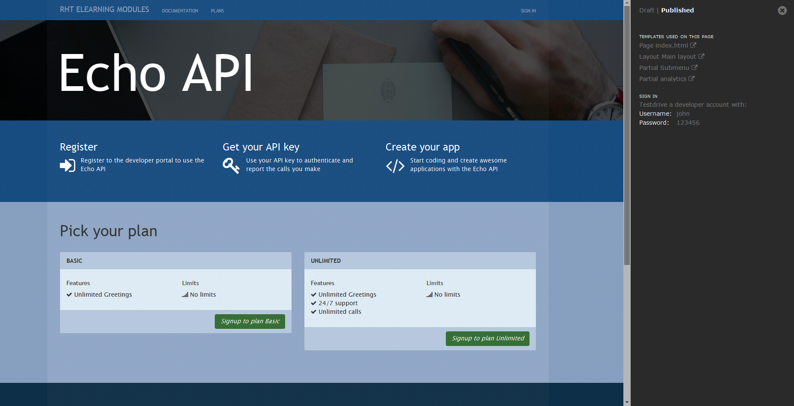
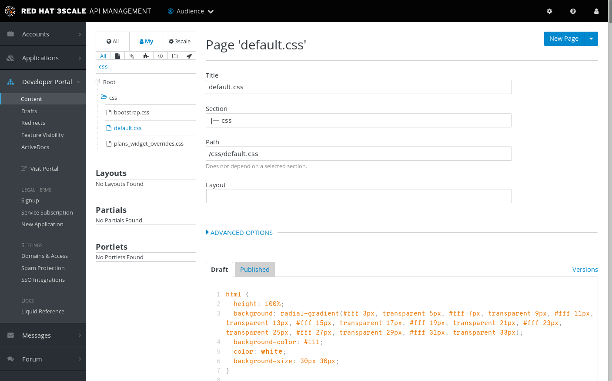
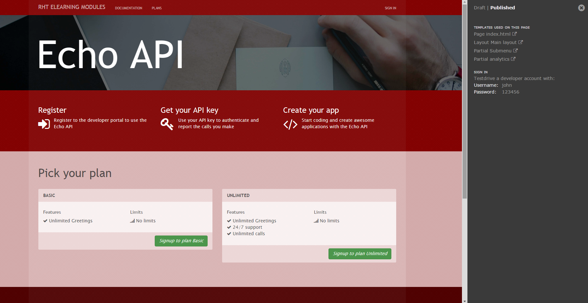
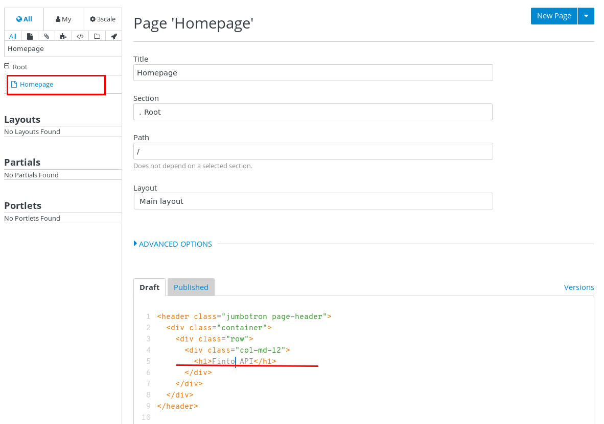
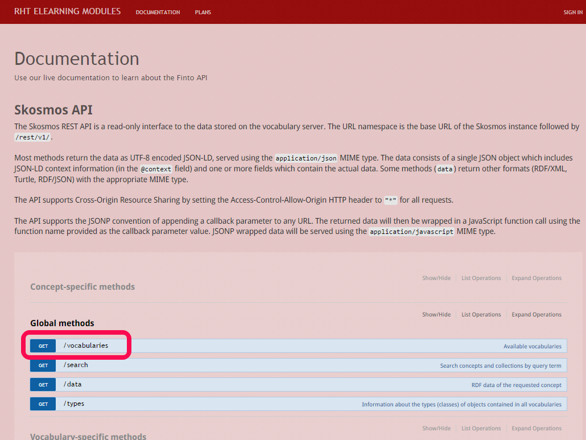

= 开发者门户
:toc: manual

== 开发者门户配置项

* 登录管理门户
* 选择 `Audience` -> `Developer Portal`

如上图：

* 1 所在的区域是一些静态网页编辑文件，主要由 CSS, HTML, JavaScript 及 Liquid（进行简单判断编程，类似 JPS 中嵌套 Java）
* 2 所在的按钮是将开发者门户发布出去，让开发者可见
* 3 所在的链接可以访问开发者门户

== 开发者门户编辑

=== 修改背景颜色

* 在管理门户中选择 `Audience` -> `Developer Portal` -> `Content`
* 过滤选择 css，选择 default.css

* 在第 11 行，修改 background-color 值为 `background-color: rgba(163, 0, 0, 0.98)`
* 在页面底部，点击 `Publish` 发布
* 刷新开发者界面，背景颜色变为红色

=== 修改欢迎页面内容

* 在管理门户中选择 `Audience` -> `Developer Portal` -> `Content`
* 过滤选择 Homepage

* 修改第 5 行，将 `Echo API` 改为 `Finto API`
* 查找所有 `Echo`，并将其替换为 `Finto`
* 删除 185 行以后所有行
* 在页面底部，点击 `Publish` 发布
* 刷新开发者界面，查看新的开发者门户界面

== 导入 OAI 2.0 文档

=== API 文档导入

* 选择 `API` -> `ActiveDocs`
* 选择 Echo 并删除
* 在文档列表右侧点击 `Create a new spec`
** Name - `Finto API Specification`
** System name - `finto_spec`
** 选择 `Publish`
** Description - `This is the Finto API Specification.`
** API JSON Spec - 拷贝 http://api.finto.fi/rest/v1/swagger.json[http://api.finto.fi/rest/v1/swagger.json] 中的内容 

=== API 文档编辑

[source, json]
.*1. 编辑第 8 - 10 行，从 schemes 中删除 http*
----
  "schemes": [
    "https"
  ]
----

[source, json]
.*2. 编辑 11 行，在 basePath 之前添加 host*
----
  "host": "api-3scale-apicast-production.apps.example.com",
  "basePath": "/rest/v1",
----

[source, json]
.*3. 编辑所有 endpoints，添加*
----
{
    "name": "user_key",
    "in": "query",
    "description": "Your API access key",
    "required": true,
    "x-data-threescale-name": "user_keys",
    "type": "string"
 }
----

== 开发者测试

在开发者门户访问 API Doc

