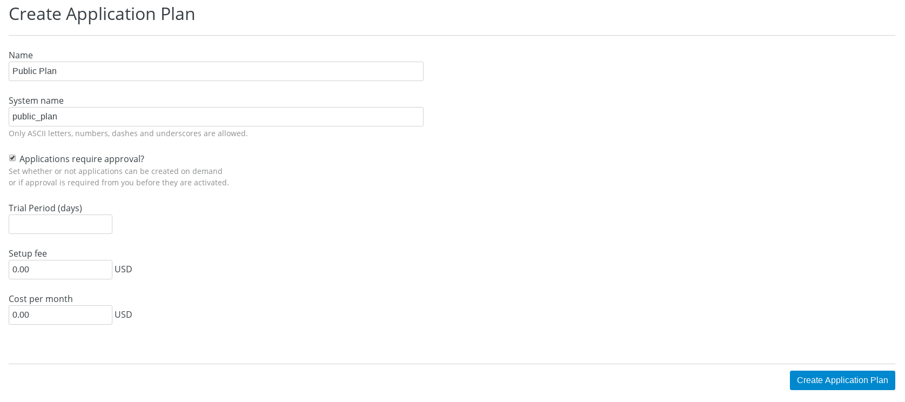

= 配置 Application Plans
:toc: manual

== 什么是 Application Plans

Application Plans 对 API 消费者定义了不同的 API 管理策略，包括访问权限、登录步骤、可接入的端点及资源、及记费模型等。牛津大学 API 门户 API 是一个很好的示例，如下图：

3Scale 定义了灵活的 Application Plans 管理计划，可以配置不同的策略。

== 目的

本部分继续前面的实验，基于 Finto API 进行，在 3Scale 管理门户进行配置 Application Plans， 具体创建两个 Application Plan:

* Public - 有限制，每小时最多访问 10 次
* Premium - 没有任何限制

== Application Plans 配置

=== Public Plan

* 登录管理门户，选择 `API` -> `Overview`
* 在 *Published Application Plans* 部分，点击 `Create Application Plan`
* `Name` 栏输入 Public Plan
* `System name` 栏输入 public_plan
* `Applications require approval?` 选择 Y
* 点击 `Create Application Plan` 按钮创建 Plan

* 点击 `Publish`，发布 Application Plan

* 在 Application Plans 列表中点击 `Public Plan`，打开新创建的 Application Plan
* 在 `Metrics, Methods & Limits` 设定 `GET /vocabularies` Enabled 为 false
* 点击 `GET /vocabularies` -> `Limits (1)` -> `New usage limit` 创建一个新的限制

image:img/3scale-app-plan-limits.png[]

* `Period` 栏选择 Hour
* `Max. value` 栏选择 10
* 点击 `Create usage limit`

* 在 `Features` 部分定义了三个 Features：Unlimited Greetings、24/7 support、Unlimited calls，可以对这些 Features 进行 Enable，Edit 或删除

image:img/3scale-features.png[]

* 点击 `New feature` 按钮
* `Name` - API Promotional Campaign
* `System name` - api_promotion
* `Description` - API Promotional Campaign

image:img/3scale-features-create.png[]

* 点击 `Save` 按钮
* 点 `Enabled` 选择框

=== Premium Plan

类似创建 Public Plan,

* 登录管理门户，选择 `API` -> `Overview`
* 在 *Published Application Plans* 部分，点击 `Create Application Plan`
* `Name` 栏输入 Premium Plan
* `System name` 栏输入 premium_plan
* `Applications require approval?` 选择 Y
* 点击 `Create Application Plan` 按钮创建 Plan

=== 发布 Plan

`Public` 和 `Premium` Plan 默认都是在 hidden 状态，如下图

image:img/3scale-plan-publish.png[]

在管理门户中选择 `API` -> `Applications` -> `Application Plans` 可以进入到如上界面，点击对应绿色 `Publish` 链接可以发布 Plan。

== 管理开发者账户

本部分创建一个开发者账户，关联两个 App，两个 App 分别关联两个 Plan。

=== Developer 创建

* 选择 `Audience` -> `Accounts` -> `Listing`
* 点击 `Create` 按钮

* 在用户名、邮件、密码、描述等输入如下信息

image:img/3scale-developer-account-new.png[]

* 点击 `Create` 完成创建
* 查看创建的开发者账户，关联了一个应用，一个用户

=== Public App 创建

本部分删除之前创建的默认 Application, 同时创建一个新的 `application` 关联到 `Public Plan`。

* 点击 `1 Application` 链接
* 点击应用名称 `Promotional Group's App`
* 点击应用名称旁边编辑按钮

image:img/3scale-application-edit.png[]

* 点击 `delete` 删除应用
* 选择 `Audience` -> `Accounts` -> `Listing`，点击 organization/group 名称 `Promotional Group`
* 点击 `0 Application` 链接，点击 `Create Application` 按钮
* 在 Application plan 下拉单中选择 Public Plan
* 在 Name 栏输入 Public App
* 在 Description 栏输入描述内容

image:img/3scale-account-new-application.png[]

* 点击 `Create Application` 创建应用
* 在 Public App 界面查看，右侧关联的 Application Plan 是 Public Plan，API Credentials 部分生成了一个 User Key，记录此 Key，后续测试部分会用到。
* 在 `State` 部分点击 `Accept` 按钮，确保状态为 Live

=== Premium App 创建

类似 Public App 创建步骤，

* 选择 `Audience` -> `Accounts` -> `Listing`，点击 organization/group 名称 `Promotional Group`
* 点击 `0 Application` 链接，点击 `Create Application` 按钮
* 在 Application plan 下拉单中选择 Premium Plan
* 在 Name 栏输入 Premium App 
* 在 Description 栏输入描述内容
* 点击 `Create Application` 创建应用
* 在 Premium App 界面查看，右侧关联的 Application Plan 是 Premium Plan，API Credentials 部分生成了一个 User Key，记录此 Key，后续测试部分会用到。
* 在 `State` 部分点击 `Accept` 按钮，确保状态为 Live

== Application Plan 测试

[source, bash]
.*1. 使用 Premium App Key 连续访问 15 次，可以发现第 10 次以后访问是成功的*
----
$ for i in {1..15} ; do curl -k "https://api-3scale-apicast-production.apps.example.com:443/rest/v1/vocabularies?lang=en&user_key=3216b09a465090b08eb872f8c2671d0c" ; done
----

[source, bash]
.*2. 使用 Public App Key 连续访问 15 次，可以发现第 10 次以后访问是成功的*
----
$ for i in {1..15} ; do curl -k "https://api-3scale-apicast-production.apps.example.com:443/rest/v1/vocabularies?lang=en&user_key=351435e1f293b48b9648b91c2b2e375d" ; done
...
Limits exceeded
Limits exceeded
Limits exceeded
Limits exceeded
----

[source, bash]
.*3. 使用 Public App Key 再次访问，查看返回 HTTP Header 信息中认证失败的信息*
----
$ curl -k -v "https://api-3scale-apicast-production.apps.example.com:443/rest/v1/vocabularies?lang=en&user_key=351435e1f293b48b9648b91c2b2e375d"
* About to connect() to api-3scale-apicast-production.apps.example.com port 443 (#0)
*   Trying 10.66.208.102...
* Connected to api-3scale-apicast-production.apps.example.com (10.66.208.102) port 443 (#0)
* Initializing NSS with certpath: sql:/etc/pki/nssdb
* skipping SSL peer certificate verification
* SSL connection using TLS_ECDHE_RSA_WITH_AES_128_GCM_SHA256
* Server certificate:
* 	subject: CN=*.apps.example.com
* 	start date: Oct 21 00:08:06 2018 GMT
* 	expire date: Oct 20 00:08:07 2020 GMT
* 	common name: *.apps.example.com
* 	issuer: CN=openshift-signer@1540080138
> GET /rest/v1/vocabularies?lang=en&user_key=351435e1f293b48b9648b91c2b2e375d HTTP/1.1
> User-Agent: curl/7.29.0
> Host: api-3scale-apicast-production.apps.example.com
> Accept: */*
> 
< HTTP/1.1 429 Too Many Requests
< Server: openresty/1.13.6.2
< Date: Wed, 23 Jan 2019 15:06:16 GMT
< Content-Type: text/plain; charset=utf-8
< Transfer-Encoding: chunked
< Retry-After: 3224
< Set-Cookie: 9003998018e00c416f6584930dc9eead=6e88181200be61fd983c6637d904d677; path=/; HttpOnly
< 
* Connection #0 to host api-3scale-apicast-production.apps.example.com left intact
Limits exceeded
----

[source, bash]
.*4. 使用 Public App Key 连续访问 15 次非限流的 API(types), 都可以成功*
----
$ for i in {1..15} ; do curl -k "https://api-3scale-apicast-production.apps.example.com:443/rest/v1/types?lang=en&user_key=351435e1f293b48b9648b91c2b2e375d" ; done
----
