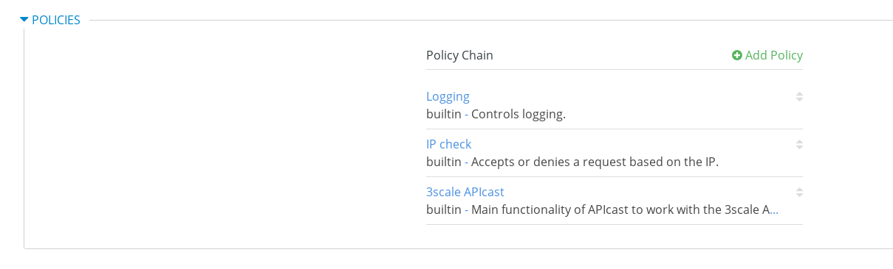

= 微服务管理
:toc: manual

== 微服务介绍

本部分部署 https://github.com/redhat-china/rhoar-getting-started 部分描述的微服务到 OpenShift。

[cols="2,2,5a,5a"]
|===
|名称 |框架 |API 路径 |说明及部署文档

|inventory
|vertx
|
* api/inventory
* api/inventory?name=NAME
|https://github.com/redhat-china/rhoar-getting-started/blob/master/vertx/README.adoc[详细文档]

|booking
|nodejs
|
* api/booking
* api/booking?name=NAME
|https://github.com/redhat-china/rhoar-getting-started/blob/master/nodejs/README.adoc[详细文档]

|fruits
|spring
|
* api/fruits
* api/fruits/{ID}
|https://github.com/redhat-china/rhoar-getting-started/blob/master/springboot/README.adoc[详细文档]

|cooking
|thorntail
|
* api/cooking
* api/cooking?name=NAME
|https://github.com/redhat-china/rhoar-getting-started/blob/master/thorntail/README.adoc[详细文档]
|===

[source, java]
.*1. 创建 backend-services 工程*
----
$ oc login https://master.example.com:8443 -u admin -p admin
$ oc new-project backend-services
----

[source, java]
.*2. 部署微服务*
----
$ cd rhoar-getting-started/vertx/
$ mvn package fabric8:deploy -Popenshift

$ cd rhoar-getting-started/springboot/
$ mvn package fabric8:deploy -Popenshift

$ cd rhoar-getting-started/thorntail/
$ mvn package fabric8:deploy -Popenshift

$ cd rhoar-getting-started/nodejs/
$ npm run openshift
----

[source, json]
.*3. 微服务测试*
----
# curl http://inventory-backend-services.apps.example.com/api/inventory
{"content" : "RHEL 7.6"}
# curl http://inventory-backend-services.apps.example.com/api/inventory?name="OpenShift"
{"content" : "OpenShift"}

# curl http://fruits-backend-services.apps.example.com/api/fruits
[{"id":1,"name":"Cherry"},{"id":2,"name":"Apple"},{"id":3,"name":"Banana"}]
# curl http://fruits-backend-services.apps.example.com/api/fruits/1
{"id":1,"name":"Cherry"}

# curl http://cooking-backend-services.apps.example.com/api/cooking
{"content":"Egg"}
# curl http://cooking-backend-services.apps.example.com/api/cooking?name=Par
{"content":"Par"}

# curl http://booking-backend-services.apps.example.com/api/booking
{"booking":"ROW10086"}
# curl http://booking-backend-services.apps.example.com/api/booking?name=ABC123
{"booking":"ABC123"}
----

=== Open API 文档

Fruits 服务定义了 Swagger 2.0 文档

Spec 链接： http://fruits-backend-services.apps.example.com/api/swagger.json

将上面链接中内容导入 http://editor.swagger.io/[http://editor.swagger.io]， 可以看到如下 API 编辑界面

image:img/backend-services-docs-editor.png[]

测试 API 可以访问 http://fruits-backend-services.apps.example.com/swagger-ui.html

在如上界面上依次测试 `GET`、`POST`、`PUT`、`DELETE` 等方法。

== Cooking 服务管理

=== 目的

本部分说明如何通过 3Scale 管理微服务。具体要求包括：

* 每一个服务都有一个 basic plan 和一个 premium  plan
** basic plan 每小时只能访问 10 次，且不能访问某些 CRUD 操作
** premium  plan 没有任何限制
* 服务必须以安全加密的方式进行访问
* Metrics 应该详细设定

=== API Gateway 上创建 Stage 和 Prod 路径

NOTE: 本部分内容可选择，如果不创建，则在后续服务集成步骤在 3Scale 界面点击创建。

[source, text]
----
# oc create route edge cooking-apicast-prod --service=apicast-production --hostname=cooking-apicast-prod.apps.example.com -n 3scale-amp
# oc create route edge cooking-apicast-staging --service=apicast-staging --hostname=cooking-apicast-staging.apps.example.com -n 3scale-amp

# oc get route -n 3scale-amp | grep cooking
cooking-apicast-prod      cooking-apicast-prod.apps.example.com                      apicast-production        gateway   edge          None
cooking-apicast-staging   cooking-apicast-staging.apps.example.com                   apicast-staging           gateway   edge          None
----

=== 创建 Cooking API

* 登录 3Scale 管理门户
* 选择 `Dashboard` -> `APIS`
* 点击 `New API` 链接，开始创建一个 API
* 在新弹出的对话框中输入
** Name - `Cooking`
** System name - `cooking_api`
** Description - `Cooking API`

image:img/3scale-new-api-cooking.png[]

* 点击 `Add API` 按钮完成创建

=== 定义 Methods 及 Metrics

在管理门户中选择 `API:Cooking` -> `Integration` -> `Methods & Metrics`，

image:img/3scale-api-integration-methods.png[]

在 Methods & Metrics 视图下可以定义 Methods 及 Metrics，Methods 是和后端 API 进行映射，Metrics 是指管理策略的定义，具体包括：Hits、megabytes、CPU time 等。

* 在 Methods 列表右端点击 `New method`
* 在弹出的界面中输入：
** `Friendly name` -  GET /cooking
** `System name` -  get_cooking
** `Description` - cooking GET endpoint that returns list of cookings

image:img/3scale-new-methods-cooking.png[]

 点击 `Create Method` 按钮
* 创建完成后 Methods 列表中会有一个 GET /cooking， 出现。
* Metrics 定义使用默认定义，仅收集 Hits 数据，及只收集 API 访问次数的记录。

=== 创建 Application Plan

==== 创建 Basic Application Plan

* 登录管理门户，选择 `API:Cooking` -> `Overview`
* 在 *Published Application Plans* 部分，点击 `Create Application Plan`
* `Name` 栏输入 Cooking Basic
* `System name` 栏输入 cooking_basic
* `Applications require approval?` 选择 Y
* 点击 `Create Application Plan` 按钮创建 Plan

image:img/3scale-create-app-plan-cooking-basic.png[]

* 在 Application Plans 列表中点击 `Cooking Basic`，打开新创建的 Application Plan
* 点击 `GET /cooking` -> `Limits (0)` -> `New usage limit` 创建一个新的限制

image:img/3scale-cooking-new-limit.png[]

* `Period` 栏选择 Hour
* `Max. value` 栏选择 100
* 点击 `Create usage limit`

==== 创建 Premium Application Plan

* 登录管理门户，选择 `API:Cooking` -> `Overview`
* 在 *Published Application Plans* 部分，点击 `Create Application Plan`
* `Name` 栏输入 Cooking Premium
* `System name` 栏输入 cooking_premium
* `Applications require approval?` 选择 Y
* 点击 `Create Application Plan` 按钮创建 Plan

image:img/3scale-create-app-plan-cooking-premium.png[]

=== 创建开发者账户

* 登录 3Scale 管理门户
* 选择 `Audience` -> `Accounts` -> `Listing`
* 点击 `Create` 按钮，在弹出的 Create new Account 界面填入如下内容
** Username - cooking_user
** Email - cooking_user@example.com
** Password - redhat
** Organization/Group Name - cooking_account

image:img/3scale-create-account-cooking.png[]

* 点击 `Create` 完成创建
* 查看创建的开发者账户，关联了一个应用(自动生成)，一个用户，编辑自动生成的应用，并删除

=== 创建 Application

==== 创建 Cooking Basic Application 关联 Basic Application Plan

* 选择 `Audience` -> `Accounts` -> `Listing`，点击 `cooking_account`
* 点击 `0 Application` 链接，点击 `Create Application` 按钮
* 在 Application plan 下拉单中选择 `Cooking Basic`
* 在 Name 栏输入 `Cooking Basic Application`
* 在 Description 栏输入描述内容

image:img/3scale-create-app-cooking-basic.png[]

* 点击 `Create Application` 创建应用
* 在 Cooking Basic Application 界面查看，右侧关联的 Application Plan 是 Cooking Basic，API Credentials 部分生成了一个 User Key
* 在 `State` 部分点击 `Accept` 按钮，确保状态为 Live

==== 创建 Cooking Premium Application 关联 Premium Application Plan

* 选择 `Audience` -> `Accounts` -> `Listing`，点击 `cooking_account`
* 点击 `1 Application` 链接，点击 `Create Application` 按钮
* 在 Application plan 下拉单中选择 `Cooking Premium`
* 在 Name 栏输入 `Cooking Premium Application`
* 在 Description 栏输入描述内容

image:img/3scale-create-app-cooking-premium.png[]

* 点击 `Create Application` 创建应用
* 在 Cooking Premium Application 界面查看，右侧关联的 Application Plan 是 Cooking Premium，API Credentials 部分生成了一个 User Key
* 在 `State` 部分点击 `Accept` 按钮，确保状态为 Live

=== 微服务集成

* 在管理门户中选择 `API:Cooking` -> `Integration` -> `Configuration`
* 点击 *Add the base URL of your API and save the configuration* 按钮
* 在 Integration 界面填入
** Private Base URL: http://cooking-backend-services.apps.example.com:80
** Staging Public Base URL: https://cooking-apicast-staging.apps.example.com:443
** Production Public Base URL: https://cooking-apicast-prod.apps.example.com:443
* 定义 MAPPING RULES: `/api/cooking` -> `get_cooking`

* 在 *Update & test in Staging Environment* 部分填入 API test GET request URL 为 `/api/cooking`
* 点击 *Update & test in Staging Environment*，正确结果如下图

* 点击 *Back to Integration & Configuration* 返回
* 点击 *Promote v. 1 to Production* 发布

=== 微服务访问测试

选择 `Audience` -> `Application` -> `Listing`, 分别点击 Cooking Basic Application 和 Cooking Premium Application，分别记录对应 User Key。

[source, bash]
.*1. 以 Cooking Basic Application 对应的 User Key 访问 cooking 服务 105 次，发现 100 次以后访问受限*
----
$ for i in {1..105} ; do curl -k "https://cooking-apicast-prod.apps.example.com/api/cooking?user_key=944434733d05d21fcfa95caf6dca2770" ; done
...
Limits exceeded
Limits exceeded
Limits exceeded
Limits exceeded
----

[source, bash]
.*2. 以 Cooking Premium Application 对应的 User Key 访问 cooking 服务 105 次，发现服务一直可以被访问*
----
$ for i in {1..105} ; do curl -k "https://cooking-apicast-prod.apps.example.com/api/cooking?user_key=51fb4712fef863458c8ea355c1b64cbd" ; echo ; done
----

== Fruits 服务管理

=== 目的

* 将 Fruits 服务进行管理
* 定义 basic 和 premium 应用计划
* 定义方法和映射
* 将限流策率添加到 basic 计划，控制 API 的访问
* 开发者门户创建
* API 文档导入

=== API Gateway 上创建 Stage 和 Prod 路径

[source, text]
----
# oc create route edge fruits-apicast-prod --service=apicast-production --hostname=fruits-apicast-prod.apps.example.com -n 3scale-amp
# oc create route edge fruits-apicast-staging --service=apicast-staging --hostname=fruits-apicast-staging.apps.example.com -n 3scale-amp
----

NOTE: 如果不创建 Stage 和 Prod 路径，则在后续服务集成步骤在 3Scale 界面点击创建。

=== 创建 Fruits API

* 登录 3Scale 管理门户
* 选择 `Dashboard` -> `APIS`
* 点击 `New API` 链接，开始创建一个 API
* 在新弹出的对话框中输入
** Name - `Fruits`
** System name - `fruits_api`
** Description - `Fruits API`

image:img/3scale-new-api-fruits.png[]

* 点击 `Add API` 按钮完成创建

=== 创建 Application Plan

==== 创建 Basic Application Plan

* 登录管理门户，选择 `API:Fruits` -> `Overview`
* 在 *Published Application Plans* 部分，点击 `Create Application Plan`
* `Name` 栏输入 Basic
* `System name` 栏输入 fruits_basic
* `Applications require approval?` 选择 Y
* 点击 `Create Application Plan` 按钮创建 Plan

* 在 Application Plans 列表中点击 `Publish` 发布 Basic Plan

==== 创建 Premium Application Plan

* 登录管理门户，选择 `API:Fruits` -> `Overview`
* 在 *Published Application Plans* 部分，点击 `Create Application Plan`
* `Name` 栏输入 Premium
* `System name` 栏输入 fruits_premium
* `Applications require approval?` 选择 Y
* 点击 `Create Application Plan` 按钮创建 Plan

* 在 Application Plans 列表中点击 `Publish` 发布 Premium Plan
* 在 Default Plan 下拉菜单中选择默认 Plan 为 Basic 

=== 创建开发者账户

* 登录 3Scale 管理门户
* 选择 `Audience` -> `Accounts` -> `Listing`
* 点击 `Create` 按钮，在弹出的 Create new Account 界面填入如下内容
** Username - fruits_user
** Email - fruits_user@example.com
** Password - redhat
** Organization/Group Name - RH/Fruits

* 点击 `Create` 完成创建
* 查看创建的开发者账户，关联了一些应用(自动生成)，一个用户，编辑自动生成的应用，并删除

=== 创建 Application

==== 创建 Basic Application 关联 Basic Application Plan

* 选择 `Audience` -> `Accounts` -> `Listing`，点击 `RH/Fruits`
* 点击 `0 Application` 链接，点击 `Create Application` 按钮
* 在 Application plan 下拉单中选择 `Basic`
* 在 Name 栏输入 `Fruits Basic Application`
* 在 Description 栏输入描述内容

* 点击 `Create Application` 创建应用
* 在 Fruits Basic Application 界面查看，右侧关联的 Application Plan 是 Basic，API Credentials 部分生成了一个 User Key
* 在 `State` 部分点击 `Accept` 按钮，确保状态为 Live

==== 创建 Premium Application 关联 Premium Application Plan

* 选择 `Audience` -> `Accounts` -> `Listing`，点击 `RH/Fruits`
* 点击 `1 Application` 链接，点击 `Create Application` 按钮
* 在 Application plan 下拉单中选择 `Premium`
* 在 Name 栏输入 `Fruits Premium Application`
* 在 Description 栏输入描述内容

image:img/3scale-create-app-fruits-premium.png[]

* 点击 `Create Application` 创建应用
* 在 Fruits Premium Application 界面查看，右侧关联的 Application Plan 是 Premium，API Credentials 部分生成了一个 User Key
* 在 `State` 部分点击 `Accept` 按钮，确保状态为 Live

=== 微服务集成

* 在管理门户中选择 `API:Fruits` -> `Integration` -> `Configuration`
* 点击 *Add the base URL of your API and save the configuration* 按钮
* 在 Integration 界面填入
** Private Base URL: http://fruits-backend-services.apps.example.com:80
** Staging Public Base URL: https://fruits-apicast-staging.apps.example.com:443
** Production Public Base URL: https://fruits-apicast-prod.apps.example.com:443
* 定义 MAPPING RULES: `/api/cooking` -> `get_cooking`

* 保持其它配置项目不变
* 在 *Update & test in Staging Environment* 部分填入 API test GET request URL 为 `/api/fruits`
* 点击 *Update & test in Staging Environment*，正确结果如下图

image:img/3scale-api-integration-test-fruits.png[]

* 点击 *Back to Integration & Configuration* 返回
* 点击 *Promote v. 1 to Production* 发布

=== 微服务访问测试

选择 `Audience` -> `Application` -> `Listing`, 分别点击 Fruits Basic Application 和 Fruits Premium Application，分别记录对应 User Key。

[source, bash]
.*1. 以 Fruits Basic Application 对应的 User Key 访问 Fruits 服务 15 次，发现服务一直可以被访问*
----
$ for i in {1..15} ; do curl -k "https://fruits-apicast-prod.apps.example.com/api/fruits?user_key=3b823b8877d11023bdf8cb5477251883" ; echo ; done
[{"id":1,"name":"Cherry"},{"id":2,"name":"Apple"},{"id":3,"name":"Banana"}]
[{"id":1,"name":"Cherry"},{"id":2,"name":"Apple"},{"id":3,"name":"Banana"}]
[{"id":1,"name":"Cherry"},{"id":2,"name":"Apple"},{"id":3,"name":"Banana"}]
[{"id":1,"name":"Cherry"},{"id":2,"name":"Apple"},{"id":3,"name":"Banana"}]
[{"id":1,"name":"Cherry"},{"id":2,"name":"Apple"},{"id":3,"name":"Banana"}]
[{"id":1,"name":"Cherry"},{"id":2,"name":"Apple"},{"id":3,"name":"Banana"}]
[{"id":1,"name":"Cherry"},{"id":2,"name":"Apple"},{"id":3,"name":"Banana"}]
[{"id":1,"name":"Cherry"},{"id":2,"name":"Apple"},{"id":3,"name":"Banana"}]
[{"id":1,"name":"Cherry"},{"id":2,"name":"Apple"},{"id":3,"name":"Banana"}]
[{"id":1,"name":"Cherry"},{"id":2,"name":"Apple"},{"id":3,"name":"Banana"}]
[{"id":1,"name":"Cherry"},{"id":2,"name":"Apple"},{"id":3,"name":"Banana"}]
[{"id":1,"name":"Cherry"},{"id":2,"name":"Apple"},{"id":3,"name":"Banana"}]
[{"id":1,"name":"Cherry"},{"id":2,"name":"Apple"},{"id":3,"name":"Banana"}]
[{"id":1,"name":"Cherry"},{"id":2,"name":"Apple"},{"id":3,"name":"Banana"}]
[{"id":1,"name":"Cherry"},{"id":2,"name":"Apple"},{"id":3,"name":"Banana"}]
----

[source, bash]
.*2. 以 Fruits Premium Application 对应的 User Key 访问 Fruits 服务 15 次，发现服务一直可以被访问*
----
$ for i in {1..15} ; do curl -k "https://fruits-apicast-prod.apps.example.com/api/fruits?user_key=e2403e7bc537bfd24aee7e3cfa8b0991" ; echo ; done
[{"id":1,"name":"Cherry"},{"id":2,"name":"Apple"},{"id":3,"name":"Banana"}]
[{"id":1,"name":"Cherry"},{"id":2,"name":"Apple"},{"id":3,"name":"Banana"}]
[{"id":1,"name":"Cherry"},{"id":2,"name":"Apple"},{"id":3,"name":"Banana"}]
[{"id":1,"name":"Cherry"},{"id":2,"name":"Apple"},{"id":3,"name":"Banana"}]
[{"id":1,"name":"Cherry"},{"id":2,"name":"Apple"},{"id":3,"name":"Banana"}]
[{"id":1,"name":"Cherry"},{"id":2,"name":"Apple"},{"id":3,"name":"Banana"}]
[{"id":1,"name":"Cherry"},{"id":2,"name":"Apple"},{"id":3,"name":"Banana"}]
[{"id":1,"name":"Cherry"},{"id":2,"name":"Apple"},{"id":3,"name":"Banana"}]
[{"id":1,"name":"Cherry"},{"id":2,"name":"Apple"},{"id":3,"name":"Banana"}]
[{"id":1,"name":"Cherry"},{"id":2,"name":"Apple"},{"id":3,"name":"Banana"}]
[{"id":1,"name":"Cherry"},{"id":2,"name":"Apple"},{"id":3,"name":"Banana"}]
[{"id":1,"name":"Cherry"},{"id":2,"name":"Apple"},{"id":3,"name":"Banana"}]
[{"id":1,"name":"Cherry"},{"id":2,"name":"Apple"},{"id":3,"name":"Banana"}]
[{"id":1,"name":"Cherry"},{"id":2,"name":"Apple"},{"id":3,"name":"Banana"}]
[{"id":1,"name":"Cherry"},{"id":2,"name":"Apple"},{"id":3,"name":"Banana"}]
----

NOTE: 虽然服务可以被访问，但没有对其进行调运统计及增加限制，随后的部分将添加 Methods，Mappings，Rate Limiting 等进行 API 调运统计归纳，及访问限制。

=== 定义 Methods

在管理门户中选择 `API:Fruits` -> `Integration` -> `Methods & Metrics`，

image:img/3scale-api-integration-methods.png[]

在 Methods & Metrics 视图下可以定义 Methods 及 Metrics，Methods 是和后端 API 进行映射，Metrics 是指管理策略的定义，具体包括：Hits、megabytes、CPU time 等。

* 在 Methods 列表右端点击 `New method`
* 在弹出的界面中输入：
** `Friendly name` -  GET /fruits
** `System name` -  fruits/getAll
** `Description` - Get all fruits

image:img/3scale-new-methods-fruits.png[]

* 点击 `Create Method` 按钮
* 创建完成后 Methods 列表中会有一个 GET /fruits， 出现。
* 重复以上步骤，添加下表中所有 Methods

|===
|*Friendly name* |*System name* |*Description*

|GET /fruit
|fruits/get
|Get a fruit by ID

|POST /fruits
|fruits/add
|Add a fruit

|PUT /fruits
|fruits/update
|Update a fruit by ID

|DELETE /fruits
|fruits/delete
|Delete a fruit by ID
|===

* 完成后定义的 Methods 列表如下图

image:img/3scale-fruits-methods-list.png[]

* Metrics 定义使用默认定义，仅收集 Hits 数据，及只收集 API 访问次数的记录。

=== 定义 Mappings 规则

* 在管理门户中选择 `API:Fruits` -> `Integration` -> `Methods & Metrics`，在 Methods 列表中 `GET /fruits` 行点击 *Add a mapping rule* 链接，则会重定向到 `API GATEWAY` -> `MAPPING RULES` 部分

image:img/3scale-mapping-rules-fruits.png[]

* 重复点击 *Add Mapping Rule* 按钮多次，一次定义 Mappings 规则与前面创建的 Methods 对应，且每次输入内如如下表

|===
|*Verb* |*Pattern* |*Method*

|GET
|/api/fruits
|fruits/getAll

|POST
|/api/fruits
|fruits/add

|GET
|/api/fruits/
|fruits/get

|PUT
|/api/fruits/
|fruits/update

|DELETE
|/api/fruits/
|fruits/delete
|===

* 点击 *Update & test in Staging Environment*，正确结果如下图

image:img/3scale-api-integration-test-fruits.png[]

* 点击 *Back to Integration & Configuration* 返回
* 点击 *Promote v. 2 to Production* 发布

=== 设定 Rate Limits

* 在管理门户，选择 `API:Fruits` -> `Overview` -> `Published Application Plans`
* 选择 `Basic`
* 滑动鼠标到 `Metrics, Methods, Limits & Pricing Rules`部分
* 点击 POST, PUT, DELETE 对应的绿色对号，Disable 掉 Basic Plan 添加、更新、删除 Fruit 的能力

==== GET /fruits 设计 Rate Limits

* 基于 `GET /fruits` 方法行，点击 `Limits (0)`
* 点击 `New Usage limit` 按钮，添加如下值
** Period - `hour`
** Max. value - `10`

image:img/3scale-uage-limits-10-per-hour.png[]

* 点击 *Create usage limit* 按钮，创建 Basic 计划每小时允许访问查询所有 Fruits 10 次
* 重复上面步骤，创建 Basic 计划每分钟允许访问查询所有 Fruits 2 次

==== GET /fruit 设计 Rate Limits

* 基于 `GET /fruits` 方法行，点击 `Limits (0)`
* 点击 `New Usage limit` 按钮，添加如下值
** Period - `hour`
** Max. value - `100`

image:img/3scale-uage-limits-100-per-hour.png[]

* 点击 *Create usage limit* 按钮，创建 Basic 计划每小时允许访问查询所有 Fruits 100 次
* 重复上面步骤，创建 Basic 计划每分钟允许访问查询所有 Fruits 5 次
* 点击 *Update Application plan* 更新应用计划

=== 测试 Rate Limits

选择 `Audience` -> `Application` -> `Listing`, 分别点击 Fruits Basic Application 和 Fruits Premium Application，分别记录对应 User Key。

==== Basic Application 对应的 User Key 进行 CRUD 操作 

[source, text]
.*1. 连续执行查询所有 Fruits*
----
$ for i in {1..5} ; do curl -k "https://fruits-apicast-prod.apps.example.com/api/fruits?user_key=3b823b8877d11023bdf8cb5477251883" ; echo ; done
[{"id":1,"name":"Cherry"},{"id":2,"name":"Apple"},{"id":3,"name":"Banana"}]
[{"id":1,"name":"Cherry"},{"id":2,"name":"Apple"},{"id":3,"name":"Banana"}]
[{"id":1,"name":"Cherry"},{"id":2,"name":"Apple"},{"id":3,"name":"Banana"}]
Limits exceeded
Limits exceeded
----

[source, text]
.*2. 连续执行根据 ID 查询 Fruits*
----
$ for i in {1..10} ; do curl -k "https://fruits-apicast-prod.apps.example.com/api/fruits/1?user_key=3b823b8877d11023bdf8cb5477251883" ; echo ; done
{"id":1,"name":"Cherry"}
{"id":1,"name":"Cherry"}
{"id":1,"name":"Cherry"}
Limits exceeded
Limits exceeded
Limits exceeded
Limits exceeded
Limits exceeded
Limits exceeded
Limits exceeded
----

[source, text]
.*3. 创建一个 Fruits*
----
$ curl -k -X POST --header 'Content-Type: application/json' --header 'Accept: application/json' -d '{"id": 11, "name": "mongo"}' 'https://fruits-apicast-prod.apps.example.com/api/fruits?user_key=3b823b8877d11023bdf8cb5477251883'
Limits exceeded
----

[source, text]
.*4. 更新一个 Fruits*
----
$ curl -k -X PUT --header 'Content-Type: application/json' --header 'Accept: application/json' -d '{"id": 11, "name": "mongo"}' 'https://fruits-apicasmple.com/api/fruits/10?user_key=3b823b8877d11023bdf8cb5477251883'
Limits exceeded
----

[source, text]
.*5. 删除*
----
$ curl -k -X DELETE --header 'Accept: application/json' 'https://fruits-apicast-prod.apps.example.com/api/fruits/11?user_key=3b823b8877d11023bdf8cb5477251883'
Limits exceeded
----

==== Premium Application 对应的 User Key 进行 CRUD 操作

[source, text]
.*1. 连续执行查询所有 Fruits*
----
$ for i in {1..5} ; do curl -k "https://fruits-apicast-prod.apps.example.com/api/fruits?user_key=e2403e7bc537bfd24aee7e3cfa8b0991" ; echo ; done
[{"id":1,"name":"Cherry"},{"id":2,"name":"Apple"},{"id":3,"name":"Banana"}]
[{"id":1,"name":"Cherry"},{"id":2,"name":"Apple"},{"id":3,"name":"Banana"}]
[{"id":1,"name":"Cherry"},{"id":2,"name":"Apple"},{"id":3,"name":"Banana"}]
[{"id":1,"name":"Cherry"},{"id":2,"name":"Apple"},{"id":3,"name":"Banana"}]
[{"id":1,"name":"Cherry"},{"id":2,"name":"Apple"},{"id":3,"name":"Banana"}]
----

[source, text]
.*2. 连续执行根据 ID 查询 Fruits*
----
$ for i in {1..10} ; do curl -k "https://fruits-apicast-prod.apps.example.com/api/fruits/1?user_key=e2403e7bc537bfd24aee7e3cfa8b0991" ; echo ; done
{"id":1,"name":"Cherry"}
{"id":1,"name":"Cherry"}
{"id":1,"name":"Cherry"}
{"id":1,"name":"Cherry"}
{"id":1,"name":"Cherry"}
{"id":1,"name":"Cherry"}
{"id":1,"name":"Cherry"}
{"id":1,"name":"Cherry"}
{"id":1,"name":"Cherry"}
{"id":1,"name":"Cherry"}
----

[source, text]
.*3. 创建一个 Fruits*
----
$ curl -k -X POST --header 'Content-Type: application/json' --header 'Accept: application/json' -d '{"id": 11, "name": "mongo"}' 'https://fruits-apicast-prod.apps.example.com/api/fruits?user_key=e2403e7bc537bfd24aee7e3cfa8b0991'
{"id":11,"name":"mongo"}
----

[source, text]
.*4. 更新一个 Fruits*
----
$ curl -k -X PUT --header 'Content-Type: application/json' --header 'Accept: application/json' -d '{"id": 11, "name": "mongoDB"}' 'https://fruits-apicast-prod.apps.example.com/api/fruits/11?user_key=e2403e7bc537bfd24aee7e3cfa8b0991'
{"id":11,"name":"mongoDB"}
----

[source, text]
.*5. 删除*
----
$ curl -k -X DELETE --header 'Accept: application/json' 'https://fruits-apicast-prod.apps.example.com/api/fruits/11?user_key=e2403e7bc537bfd24aee7e3cfa8b0991'
----

== Booking 服务管理

=== 目的

本部分是对 API 网关的个性化定制，基于两个流行的插件，通过定义策略链的方式，实现 API 网关

* 日志记录
* IP 检测

=== API Gateway 上创建 Stage 和 Prod 路径

NOTE: 本部分内容可选择，如果不创建，则在后续服务集成步骤在 3Scale 界面点击创建。

[source, bash]
----
oc create route edge booking-apicast-prod --service=apicast-production --hostname=booking-apicast-prod.apps.example.com -n 3scale-amp
oc create route edge booking-apicast-staging --service=apicast-staging --hostname=booking-apicast-staging.apps.example.com -n 3scale-amp
----

=== 创建 Booking API

* 登录 3Scale 管理门户
* 选择 `Dashboard` -> `APIS`
* 点击 `New API` 链接，开始创建一个 API
* 在新弹出的对话框中输入
** Name - `Booking`
** System name - `booking_api`
** Description - `Booking API`
* 点击 `Add API` 按钮完成创建

=== 定义 Methods 及 Metrics

在管理门户中选择 `API:Booking` -> `Integration` -> `Methods & Metrics`，

image:img/3scale-api-integration-methods.png[]

在 Methods & Metrics 视图下可以定义 Methods 及 Metrics，Methods 是和后端 API 进行映射，Metrics 是指管理策略的定义，具体包括：Hits、megabytes、CPU time 等。

* 在 Methods 列表右端点击 `New method`
* 在弹出的界面中输入：
** `Friendly name` -  GET /booking
** `System name` -  get_booking
** `Description` - Booking GET endpoint that returns list of bookings

 点击 `Create Method` 按钮
* 创建完成后 Methods 列表中会有一个 GET /booking， 出现。
* Metrics 定义使用默认定义，仅收集 Hits 数据，及只收集 API 访问次数的记录。

=== 创建 Application Plan

* 登录管理门户，选择 `API:booking` -> `Overview`
* 在 *Published Application Plans* 部分，点击 `Create Application Plan`
* `Name` 栏输入 Basic
* `System name` 栏输入 booking_basic
* `Applications require approval?` 选择 Y
* 点击 `Create Application Plan` 按钮创建 Plan
* 在 Application Plan 列表中点击 *Publish* 链接发布
* 在 Default Plan 中选择 Basic

=== 创建开发者账户

* 登录 3Scale 管理门户
* 选择 `Audience` -> `Accounts` -> `Listing`
* 点击 `Create` 按钮，在弹出的 Create new Account 界面填入如下内容
** Username - booking_user
** Email - booking_user@example.com
** Password - redhat
** Organization/Group Name - RH/Booking

* 点击 `Create` 完成创建

NOTE: 账户创建完成后会自动创建一个 App，并关联默认 Basic 计划。

=== 微服务集成

* 在管理门户中选择 `API:Booking` -> `Integration` -> `Configuration`
* 点击 *Add the base URL of your API and save the configuration* 按钮
* 在 Integration 界面填入
** Private Base URL: http://booking-backend-services.apps.example.com:80
** Staging Public Base URL: https://booking-apicast-staging.apps.example.com:443
** Production Public Base URL: https://booking-apicast-prod.apps.example.com:443
* 定义 MAPPING RULES: `/api/booking` -> `get_booking`

* 在 *Update & test in Staging Environment* 部分填入 API test GET request URL 为 `/api/booking`
* 点击 *Update & test in Staging Environment*，正确结果如下图

* 点击 *Back to Integration & Configuration* 返回
* 点击 *Promote v. 1 to Production* 发布

=== 微服务访问测试

选择 `Audience` -> `Application` -> `Listing`, 点击 RH/Booking's App，记录 User Key。使用此 User Key，执行如下 GET 调运 10 次。

[source, bash]
----
$ for i in {1..10} ; do curl -k "https://booking-apicast-prod.apps.example.com/api/booking?user_key=ca6d73f3aff8addf7eb2d73896af7302" ; echo ; done
{"booking":"ROW10086"}
{"booking":"ROW10086"}
{"booking":"ROW10086"}
{"booking":"ROW10086"}
{"booking":"ROW10086"}
{"booking":"ROW10086"}
{"booking":"ROW10086"}
{"booking":"ROW10086"}
{"booking":"ROW10086"}
{"booking":"ROW10086"}
----

=== Logging Policy 设置

* 在管理门户中选择 `API:Booking` -> `Integration` -> `Configuration`
* 点击 `edit APIcast configuration` 链接
* 滑动鼠标到 `POLICIES` 部分，点击 *Add Policy* 按钮

image:img/3scale-apigatewat-policy-add.png[]

* 点击选择 `Logging`
* 拖动 `Logging` 策略，使之在 `3scale Apicast` 之前

image:img/3scale-apigateway-policy-chians.png[]

* 点击 `Logging` 策略，展开更多配置项目，选择 `enable_access_logs`

* 点击 *Update Policy* 按钮完成 Logging 策略设置
* 点击 *Update and test in Staging Environment* 测试配置

=== Logging Policy 测试

[source, text]
.*1. 重新部署 stage-apicast*
----
oc rollout latest dc/apicast-staging
----

[source, text]
.*2. Staging URL 访问 Booking Service*
----
$ curl -k "https://booking-apicast-staging.apps.example.com/api/booking?user_key=ca6d73f3aff8addf7eb2d73896af7302"
{"booking":"ROW10086"}
----

[source, text]
.*3. stage-apicast 容器上查看 access 日志*
----
[26/Jan/2019:00:22:49 +0000] booking-apicast-staging.apps.example.com:8080 10.244.6.1:51846 "GET /api/booking?user_key=ca6d73f3aff8addf7eb2d73896af7302 HTTP/1.1" 200 22 (0.052) 0
----

=== IP Check Logging Policy 设置

* 在管理门户中选择 `API:Booking` -> `Integration` -> `Configuration`
* 点击 `edit APIcast configuration` 链接
* 滑动鼠标到 `POLICIES` 部分，点击 *Add Policy* 按钮
* 在下拉的 Policy 列表中选择 `IP Check`
* 点击选择 `IP Check`
* 拖动 `IP Check` 策略，使之在 `3scale Apicast` 之前，`Logging` 策略之后

* 点击 `IP Check` 策略，展开更多配置项目，配置如下所示， Block 10.66.208.101 IP 地址服务器发送请求。

image:img/3scale-apigateway-policy-chians-ipcheck-edit.png[]

* 点击 *Update Policy* 按钮完成 IP Check  策略设置
* 点击 *Update and test in Staging Environment* 测试配置

