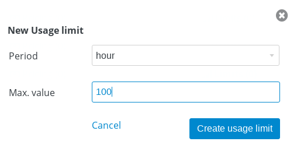

= 微服务管理
:toc: manual

== 目的

本部分说明如何通过 3Scale 管理微服务。具体要求包括：

* 每一个微服务都被独立管理
* 每一个服务都有一个 basic plan 和一个 premium	plan
** basic plan 每小时只能访问 10 此，且不能访问某些 CRUD 操作
** premium  plan 没有任何限制
* 服务必须以安全加密的方式进行访问
* Metrics 应该详细设定 

== 微服务介绍

本部分部署 https://github.com/redhat-china/rhoar-getting-started 部分描述的微服务到 OpenShift。

[cols="2,2,5a,5a"]
|===
|名称 |框架 |API 路径 |说明及部署文档

|inventory
|vertx
|
* api/inventory
* api/inventory?name=NAME
|https://github.com/redhat-china/rhoar-getting-started/blob/master/vertx/README.adoc[详细文档]

|booking
|nodejs
|
* api/booking
* api/booking?name=NAME
|https://github.com/redhat-china/rhoar-getting-started/blob/master/nodejs/README.adoc[详细文档]

|fruits
|spring
|
* api/fruits
* api/fruits/{ID}
|https://github.com/redhat-china/rhoar-getting-started/blob/master/spring-rest-services/README.adoc[详细文档]

|cooking
|thorntail
|
* api/cooking
* api/cooking?name=NAME
|https://github.com/redhat-china/rhoar-getting-started/blob/master/thorntail/README.adoc[详细文档]
|===

[source, java]
.*1. 创建 backend-services 工程*
----
$ oc login https://master.example.com:8443 -u admin -p admin
$ oc new-project backend-services
----

[source, java]
.*2. 部署微服务*
----
$ cd rhoar-getting-started/vertx/
$ mvn package fabric8:deploy -Popenshift

$ cd rhoar-getting-started/spring-rest-services/
$ mvn package fabric8:deploy -Popenshift

$ cd rhoar-getting-started/thorntail/
$ mvn package fabric8:deploy -Popenshift

$ cd rhoar-getting-started/nodejs/
$ npm run openshift
----

[source, json]
.*3. 微服务测试*
----
# curl http://inventory-backend-services.apps.example.com/api/inventory
{"content" : "RHEL 7.6"}
# curl http://inventory-backend-services.apps.example.com/api/inventory?name="OpenShift"
{"content" : "OpenShift"}

# curl http://fruits-backend-services.apps.example.com/api/fruits
[{"id":1,"name":"Cherry"},{"id":2,"name":"Apple"},{"id":3,"name":"Banana"}]
# curl http://fruits-backend-services.apps.example.com/api/fruits/1
{"id":1,"name":"Cherry"}

# curl http://cooking-backend-services.apps.example.com/api/cooking
{"content":"Egg"}
# curl http://cooking-backend-services.apps.example.com/api/cooking?name=Par
{"content":"Par"}

# curl http://booking-backend-services.apps.example.com/api/booking
{"booking":"ROW10086"}
# curl http://booking-backend-services.apps.example.com/api/booking?name=ABC123
{"booking":"ABC123"}
----

== cooking 服务管理

=== 创建账户和用户

* 登录 3Scale 管理门户
* 选择 `Audience` -> `Accounts` -> `Listing`
* 点击 `Create` 按钮，在弹出的 Create new Account 界面填入如下内容
** Username - cooking_user
** Email - cooking_user@example.com
** Password - redhat
** Organization/Group Name - cooking_account

image:img/3scale-create-account-cooking.png[]

* 点击 `Create` 完成创建
* 查看创建的开发者账户，关联了一个应用(自动生成)，一个用户，编辑自动生成的应用，并删除

=== 定义 Methods 及 Metrics

在管理门户中选择 `API` -> `Integration` -> `Methods & Metrics`，

image:img/3scale-api-integration-methods.png[]

在 Methods & Metrics 视图下可以定义 Methods 及 Metrics，Methods 是和后端 API 进行映射，Metrics 是指管理策略的定义，具体包括：Hits、megabytes、CPU time 等。

* 在 Methods 列表右端点击 `New method`
* 在弹出的界面中输入：
** `Friendly name` -  GET /cooking
** `System name` -  get_cooking
** `Description` - cooking GET endpoint that returns list of cookings

image:img/3scale-new-methods-cooking.png[]

* 点击 `Create Method` 按钮
* 创建完成后 Methods 列表中会有一个 GET /cooking， 出现。
* Metrics 定义使用默认定义，仅收集 Hits 数据，及只收集 API 访问次数的记录。

=== 创建 Basic Application Plan

* 登录管理门户，选择 `API` -> `Overview`
* 在 *Published Application Plans* 部分，点击 `Create Application Plan`
* `Name` 栏输入 Cooking Basic
* `System name` 栏输入 cooking_basic
* `Applications require approval?` 选择 Y
* 点击 `Create Application Plan` 按钮创建 Plan

image:img/3scale-create-app-plan-cooking-basic.png[]

* 在 Application Plans 列表中点击 `Cooking Basic`，打开新创建的 Application Plan
* 点击 `GET /cooking` -> `Limits (0)` -> `New usage limit` 创建一个新的限制

* `Period` 栏选择 Hour
* `Max. value` 栏选择 100
* 点击 `Create usage limit`

=== 创建 Premium Application Plan 

* 登录管理门户，选择 `API` -> `Overview`
* 在 *Published Application Plans* 部分，点击 `Create Application Plan`
* `Name` 栏输入 Cooking Premium
* `System name` 栏输入 cooking_premium
* `Applications require approval?` 选择 Y
* 点击 `Create Application Plan` 按钮创建 Plan

=== 创建 Cooking Basic Application 关联 Basic Application Plan

* 选择 `Audience` -> `Accounts` -> `Listing`，点击 `cooking_account`
* 点击 `0 Application` 链接，点击 `Create Application` 按钮
* 在 Application plan 下拉单中选择 `Cooking Basic`
* 在 Name 栏输入 `Cooking Basic Application`
* 在 Description 栏输入描述内容

image:img/3scale-create-app-cooking-basic.png[]

* 点击 `Create Application` 创建应用
* 在 Cooking Basic Application 界面查看，右侧关联的 Application Plan 是 Cooking Basic，API Credentials 部分生成了一个 User Key
* 在 `State` 部分点击 `Accept` 按钮，确保状态为 Live

=== 创建 Cooking Premium Application 关联 Premium Application Plan

* 选择 `Audience` -> `Accounts` -> `Listing`，点击 `cooking_account`
* 点击 `1 Application` 链接，点击 `Create Application` 按钮
* 在 Application plan 下拉单中选择 `Cooking Premium`
* 在 Name 栏输入 `Cooking Premium Application`
* 在 Description 栏输入描述内容

image:img/3scale-create-app-cooking-premium.png[]

* 点击 `Create Application` 创建应用
* 在 Cooking Premium Application 界面查看，右侧关联的 Application Plan 是 Cooking Premium，API Credentials 部分生成了一个 User Key
* 在 `State` 部分点击 `Accept` 按钮，确保状态为 Live

=== 在 AMP 中创建 route

[source, text]
----
# oc create route edge cooking-apicast-prod --service=apicast-production --hostname=cooking-apicast-prod.apps.example.com -n 3scale-amp
# oc create route edge cooking-apicast-staging --service=apicast-staging --hostname=cooking-apicast-staging.apps.example.com -n 3scale-amp

# oc get route -n 3scale-amp | grep cooking
cooking-apicast-prod      cooking-apicast-prod.apps.example.com                      apicast-production        gateway   edge          None
cooking-apicast-staging   cooking-apicast-staging.apps.example.com                   apicast-staging           gateway   edge          None
----

