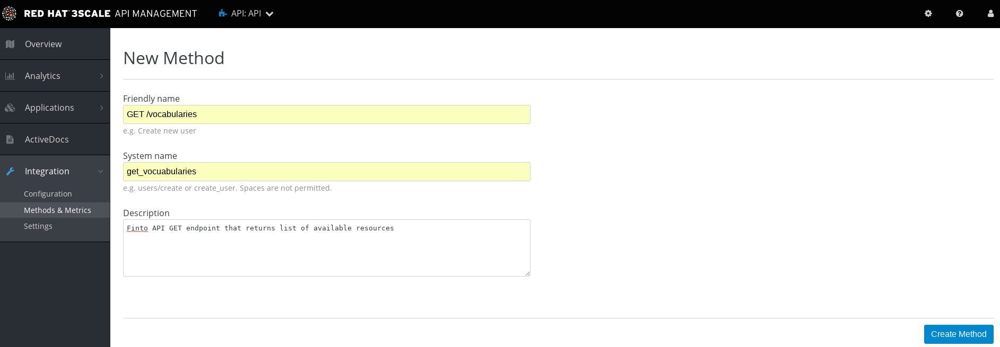
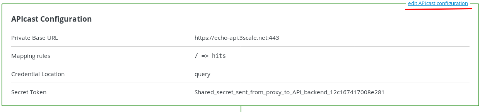
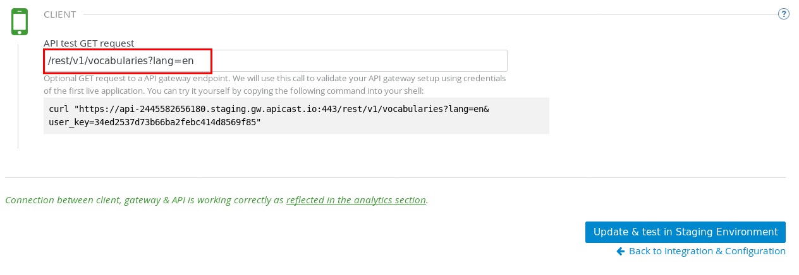
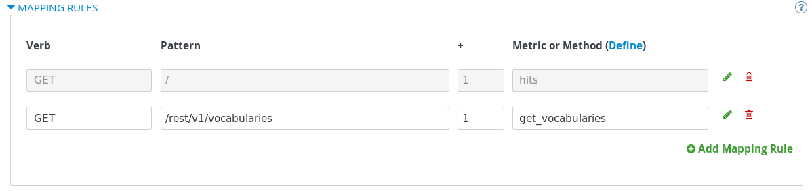
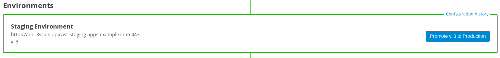

= API 管理
:toc: manual

== 目的

Finto API 是一个在线的免费 API，不需要安全认证，提供了 20 多个 API 端口，http://api.finto.fi/doc 中有详细的描述。

本部分在 3Scale 中进行管理其中一个 `GET/rest/v1/vocabularies` API.

[source, bash]
.*访问 Finto API 测试*
----
$ curl -X GET --header 'Accept: application/json' 'http://api.finto.fi/rest/v1/vocabularies?lang=en'
{"@context":{"rdfs":"http:\/\/www.w3.org\/2000\/01\/rdf-schema#","onki":"http:\/\/schema.onki.fi\/onki#","title":{"@id":"rdfs:label","@language":"en"},"vocabularies":"onki:hasVocabulary","id":"onki:vocabularyIdentifier","uri":"@id","@base":"http:\/\/api.finto.fi\/var\/www\/finto.fi\/rest\/v1\/vocabularies"},"uri":"","vocabularies":[{"uri":"afo","id":"afo","title":"AFO - Natural resource and environment ontology"},{"uri":"allars","id":"allars","title":"All\u00e4rs - General thesaurus in Swedish"},{"uri":"cer","id":"cer","title":"Clean Energy Research ontology of The Bank of Finnish Terminology in Art and Sciences"},{"uri":"cn","id":"cn","title":"Finnish Corporate Names"},{"uri":"hklj","id":"hklj","title":"HCLCS - Helsinki City Library Classification System"},{"uri":"ic","id":"ic","title":"Iconclass"},{"uri":"iptc","id":"iptc","title":"IPTC NewsCodes"},{"uri":"juho","id":"juho","title":"JUHO - Julkishallinnon ontologia"},{"uri":"jupo","id":"jupo","title":"JUPO - Finnish Ontology for Public Administration Services"},{"uri":"kassu","id":"kassu","title":"Kassu - Finnish Names of Plants"},{"uri":"kauno","id":"kauno","title":"KAUNO - ontology for fiction"},{"uri":"kaunokki","id":"kaunokki","title":"KAUNOKKI\/BELLA - thesaurus for fiction"},{"uri":"keko","id":"keko","title":"KEKO - Ontology for Education for Sustainable Development"},{"uri":"kito","id":"kito","title":"KITO - Kirjallisuudentutkimuksen ontologia"},{"uri":"koko","id":"koko","title":"KOKO Ontology"},{"uri":"kto","id":"kto","title":"KTO - Kielitieteen ontologia"},{"uri":"kulo","id":"kulo","title":"KULO - Kulttuurien tutkimuksen ontologia"},{"uri":"lapponica","id":"lapponica","title":"Lapponica"},{"uri":"lexvo","id":"lexvo","title":"Lexvo - ISO 639-3 language codes"},{"uri":"liiko","id":"liiko","title":"LIIKO - Liikenteen ontologia"},{"uri":"liito","id":"liito","title":"LIITO - Liiketoimintaontologia"},{"uri":"maotao","id":"maotao","title":"MAO\/TAO - Ontology for Museum Domain and Applied Arts"},{"uri":"mesh","id":"mesh","title":"Medical Subject Headings"},{"uri":"mts","id":"mts","title":"Metatietosanasto"},{"uri":"musa","id":"musa","title":"MUSA\/CILLA - Finnish Music Thesaurus"},{"uri":"muso","id":"muso","title":"MUSO - Ontology for Music"},{"uri":"oiko","id":"oiko","title":"OIKO - Oikeushallinnon ontologia"},{"uri":"okm-tieteenala","id":"okm-tieteenala","title":"Korkeakoulujen tutkimustiedonkeruussa k\u00e4ytett\u00e4v\u00e4 tieteenalaluokitus"},{"uri":"ponduskategorier","id":"ponduskategorier","title":"Pondus categories"},{"uri":"pto","id":"pto","title":"PTO - Finnish Geospatial Domain Ontology"},{"uri":"ptvl","id":"ptvl","title":"Julkisten palvelujen luokitus"},{"uri":"puho","id":"puho","title":"PUHO - Puolustushallinnon ontologia"},{"uri":"seko","id":"seko","title":"SEKO - Suomalainen esityskokoonpanosanasto"},{"uri":"slm","id":"slm","title":"FGF - Finnish genre and form vocabulary"},{"uri":"soto","id":"soto","title":"SOTO - Sotatieteen ontologia"},{"uri":"tero","id":"tero","title":"TERO - Finnish Ontology of Health and Welfare"},{"uri":"tsr","id":"tsr","title":"TSR ontology"},{"uri":"tt","id":"tt","title":"Tietotermit"},{"uri":"ucum","id":"ucum","title":"UCUM - The Unified Code for Units of Measure"},{"uri":"udcs","id":"udcs","title":"UDC Summary"},{"uri":"valo","id":"valo","title":"VALO - The Finnish Ontology of Photography"},{"uri":"ykl","id":"ykl","title":"PLC - Finnish Public Libraries Classification System"},{"uri":"ysa","id":"ysa","title":"YSA - General Finnish thesaurus"},{"uri":"yse","id":"yse","title":"YSAn ja YSOn k\u00e4site-ehdotukset"},{"uri":"yso","id":"yso","title":"YSO - General Finnish ontology"},{"uri":"yso-paikat","id":"yso-paikat","title":"YSO places"}]}
----

== 步骤

=== 登录

登录开发者门户。具体步骤可参照 3Scale 安装和管理门户部分。

=== 定义 Methods 及 Metrics

在管理门户中选择 `API` -> `Integration` -> `Methods & Metrics`，

image:img/3scale-api-integration-methods.png[]

在 Methods & Metrics 视图下可以定义 Methods 及 Metrics，Methods 是和后端 API 进行映射，Metrics 是指管理策略的定义，具体包括：Hits、megabytes、CPU time 等。

* 在 Methods 列表右端点击 `New method`
* 定义一个 Method 映射到 http://api.finto.fi/rest/v1/vocabularies GET A方法，具体在弹出的界面中输入：
** `Friendly name` -  GET /vocabularies  
** `System name` -  get_vocuabularies
** `Description` - Finto API GET endpoint that returns list of available resources
* 点击 `Create Method` 按钮

* 创建完成后 Methods 列表中会有一个 GET /vocabularies， 出现。
* Metrics 定义使用默认定义，仅收集 Hits 数据，及只收集 API 访问次数的记录。

=== 配置并 Staging 下测试 API 集成

* 在管理门户中选择 `API` -> `Integration` -> `Configuration` 
* 在 `APIcast Configuration` 部分选择 `edit APIcast configuration`

* 在 *Private Base URL* 部分填入：http://api.finto.fi:80
* 在 *CLIENT* 部分，`API test GET request` 中填入：/rest/v1/vocabularies?lang=en

* 点击 `Update & Test Staging Configuration` 按钮，可以看到 staging 情况下，访问可达。
* 向上选择 `API GATEWAY` -> ` MAPPING RULES` 部分，可以看到 hits Mapping rules 已经存在，点击 `Add Mapping Rule` 填加一条新的 Mapping rules。
* 选择 `Verb` 类型为 GET
* 填入 `Pattern` 的值为 /rest/v1/vocabularies
* 选择 `Metric or Method` 为之前定义的 get_vocabularies

* 在 `API GATEWAY` -> `AUTHENTICATION SETTINGS` 部分进行安全认证相关的配置
* 配置完成后再次点击 `Update & Test Staging Configuration` 按钮，可以看到 staging 情况下，访问可达。
* 点击 `Back to Integration & Configuration` 返回

=== 升级到生产

在管理门户中选择 `API` -> `Integration` -> `Configuration` -> `Environments` -> `Production Environment`

== API 测试

* 查看 public API 路径选择 `API` -> `Integration` -> `Configuration` -> `Environments` -> `Production Environment`
* 访问 URL：/rest/v1/vocabularies?lang=en
* 查看 API Key 选择 `API` -> `Applications` -> `Listing` -> `Developer's App` -> `API Credentials`

[source, bash]
.*访问 Public API 10 此示例*
----
$ for i in {1..10} ; do curl -k "https://api-3scale-apicast-production.apps.example.com:443/rest/v1/vocabularies?lang=en&user_key=1e350664e0f197c0472331c0ba2108d5" ;  done
----

* 在管理控制台选择 `API` -> `Analytics` -> `Usage` 可查看访问统计数据

