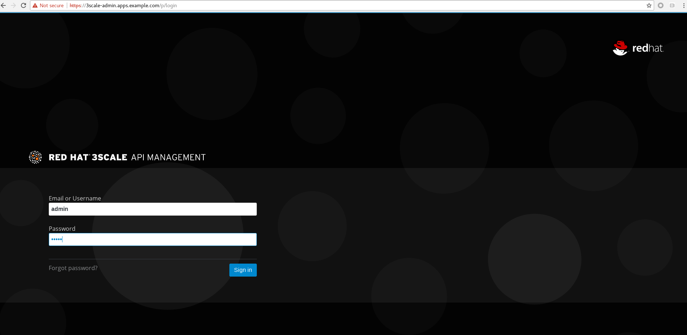

= 3Scale
:toc: manual

== 安装

=== 安装准备

*1. 确保 OpenShift 安装并正常运行.*

*2. 下载*

* 下载 3Scale 2.4 - https://github.com/3scale/3scale-amp-openshift-templates/tree/2.4.0.GA/amp

[source, bash]
----
wget https://raw.githubusercontent.com/3scale/3scale-amp-openshift-templates/2.4.0.GA/amp/amp.yml
----

*3. 创建 4 个 PV*

|===
|类型 |描述

|RWO
|redis backend, 1Gi

|RWO
|redis system, 1Gi

|RWO
|mysql, 1Gi

|RWX
|system, 100Mi
|===

[source, text]
----
# oc get pv | grep pv-3scale-24
pv-3scale-24-mysql           1Gi        RWO            Recycle          Available                   15s
pv-3scale-24-redis-backend   1Gi        RWO            Recycle          Available                   15s
pv-3scale-24-redis-system    1Gi        RWO            Recycle          Available                   15s
pv-3scale-24-system          100Mi      RWX            Retain           Available                   15s
----

[source, bash]
.*4. 下载 3Scale 2.4 所需的容器镜像*
----
registry.access.redhat.com/3scale-amp24/backend
registry.access.redhat.com/3scale-amp24/zync
registry.access.redhat.com/3scale-amp24/apicast-gateway
registry.access.redhat.com/3scale-amp22/wildcard-router
registry.access.redhat.com/3scale-amp24/system
registry.access.redhat.com/rhscl/postgresql-95-rhel7:9.5
registry.access.redhat.com/rhscl/mysql-57-rhel7:5.7
registry.access.redhat.com/3scale-amp20/memcached
registry.access.redhat.com/rhscl/redis-32-rhel7:3.2
----

[source, bash]
.*5. 设定环境变量*
----
$ export OCP_WILDCARD_DOMAIN=apps.example.com
$ export ADMIN_PASSWORD=admin
$ export MASTER_PASSWORD=master
----

=== 安装

[source, bash]
.*1 - 创建一个工程*
----
oc new-project 3scale-amp --display-name="3scale APM 2.4" --description="3scale AMP 2.4"
----

[source, bash]
.*2 - 根据模版创建容器部署对象*
----
oc new-app -f 3scale-amp-2.4.yml \
      --param ADMIN_PASSWORD=$ADMIN_PASSWORD \
      --param TENANT_NAME=3scale \
      --param MASTER_NAME=master \
      --param MASTER_PASSWORD=$MASTER_PASSWORD \
      --param WILDCARD_DOMAIN=$OCP_WILDCARD_DOMAIN > /tmp/3scale_amp_provision_details.txt
----

=== 安装验证

[source, text]
.*1. 查看运行的容器*
----
# oc get pods
NAME                              READY     STATUS    RESTARTS   AGE
apicast-production-1-g2lfd        1/1       Running   0          32m
apicast-staging-1-qs9wc           1/1       Running   0          32m
apicast-wildcard-router-1-4q8jl   1/1       Running   0          32m
backend-cron-1-wdqp9              1/1       Running   0          32m
backend-listener-1-j85fg          1/1       Running   0          32m
backend-redis-1-bq7j8             1/1       Running   0          32m
backend-worker-1-l99nc            1/1       Running   0          32m
system-app-1-5vj47                3/3       Running   0          23m
system-memcache-1-kxllm           1/1       Running   0          32m
system-mysql-1-zqlzs              1/1       Running   0          32m
system-redis-1-7crfx              1/1       Running   0          32m
system-sidekiq-1-bwkjf            1/1       Running   0          32m
system-sphinx-1-fxs8k             1/1       Running   0          32m
zync-1-6cqt2                      1/1       Running   0          32m
zync-database-1-sbgcq             1/1       Running   0          32m
----

.*2. 查看容器的镜像*

使用 https://registry-console-default.apps.example.com/registry 可以查看内部镜像仓库。

image:img/3scale-24-registries.png[]

[source, text]
.*3 - 查看创建的 PVC*
----
# oc get pvc
NAME                    STATUS    VOLUME                       CAPACITY   ACCESS MODES   STORAGECLASS   AGE
backend-redis-storage   Bound     pv-3scale-24-redis-system    1Gi        RWO                           44m
mysql-storage           Bound     pv-3scale-24-redis-backend   1Gi        RWO                           44m
system-redis-storage    Bound     pv-3scale-24-mysql           1Gi        RWO                           44m
system-storage          Bound     pv-3scale-24-system          100Mi      RWX                           44m
----

[source, bash]
.*4 - 查看 Mysql 数据库*
----
$ oc rsh $(oc get pod | grep mysql | awk '{print $1}')
$ mysql -uroot system
mysql> show tables;
----

[source, bash]
.*5 - 登录 3Scale 管理界面，执行如下命令获取登录 URL*
----
$ cat /tmp/3scale_amp_provision_details.txt | grep Login
     Login on https://3scale-admin.apps.example.com as admin/admin
----

登录 https://3scale-admin.apps.example.com 进入到 3Scale 登录界面:

使用 `admin`/`admin` 即可登录 3Scale API 管理控制台。

