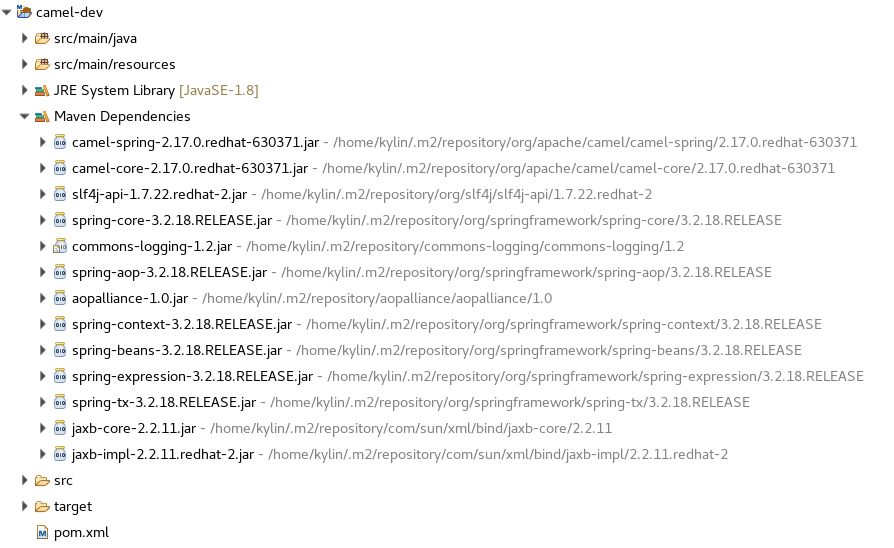
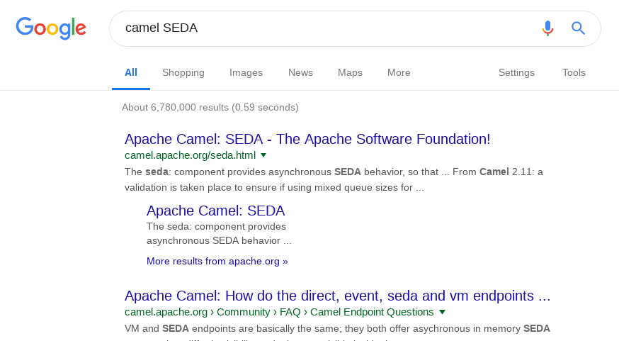
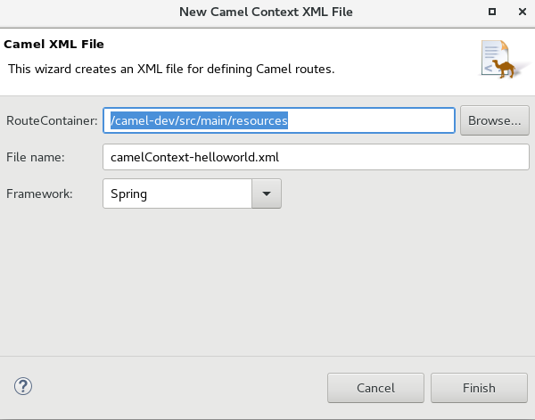
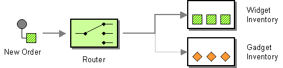
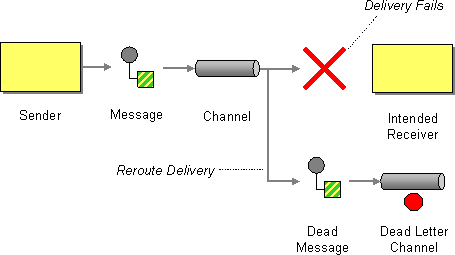
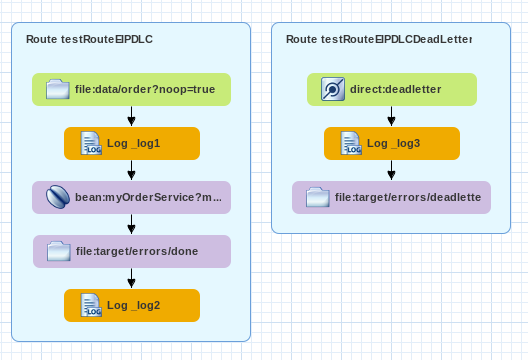

= Camel 开发
:toc: manual

== 准备

=== 生成模版项目

[source, java]
.*1. 生成 Maven 项目*
----
$ mvn archetype:generate -DgroupId=com.sample -DartifactId=camel-dev -DarchetypeArtifactId=maven-archetype-archetype -DinteractiveMode=false
----

[source, xml]
.*2. 编辑 camel-dev/pom.xml, 添加如下内容到第 8 行和第 9 行中间*
----
  <properties>
    <project.build.sourceEncoding>UTF-8</project.build.sourceEncoding>
    <version.compiler.plugin>3.5</version.compiler.plugin>
    <maven.compiler.target>1.8</maven.compiler.target>
    <maven.compiler.source>1.8</maven.compiler.source>

    <fabric8.bom.version>1.2.0.redhat-630371</fabric8.bom.version>
  </properties>

  <dependencyManagement>
    <dependencies>
      <dependency>
        <groupId>io.fabric8.bom</groupId>
        <artifactId>fabric8-bom</artifactId>
        <version>${fabric8.bom.version}</version>
        <type>pom</type>
        <scope>import</scope>
      </dependency>
    </dependencies>
  </dependencyManagement>

  <dependencies>
    <dependency>
      <groupId>org.apache.camel</groupId>
      <artifactId>camel-spring</artifactId>
    </dependency>
  </dependencies>

  <build>
    <plugins>
      <plugin>
        <artifactId>maven-compiler-plugin</artifactId>
        <version>${version.compiler.plugin}</version>
        <configuration>
          <source>${maven.compiler.source}</source>
          <target>${maven.compiler.target}</target>
        </configuration>
      </plugin>
    </plugins>
  </build>
----

[source, java]
.*3. 创建一个代码 Package 路径*
----
$ mkdir -p camel-dev/src/main/java/com/sample
$ rm -fr camel-dev/src/main/resources/archetype-resources
$ rm -fr camel-dev/src/main/resources/META-INF/maven/
----

[source, java]
.*4. 编译 Project*
----
$ cd camel-dev/
$ mvn clean install
----

*5. 编译成功后导入 camel-dev 到 IDE*

=== 日志配置

[source, java]
.*1. pom.xml 中添加依赖*
----
    <dependency>
      <groupId>org.slf4j</groupId>
      <artifactId>slf4j-log4j12</artifactId>
    </dependency>
    <dependency>
      <groupId>log4j</groupId>
      <artifactId>log4j</artifactId>
    </dependency>
----

[source, java]
.*2. Classpath 下添加 log4j.properties， 添加内容如下*
----
#
# The logging properties used for testing
#
log4j.rootLogger=ERROR, out

log4j.logger.testRoute=DEBUG
#log4j.logger.testRoute=DEBUG
#log4j.logger.testRoute=DEBUG
#log4j.logger.testRoute=DEBUG

# CONSOLE appender not used by default
log4j.appender.out=org.apache.log4j.ConsoleAppender
log4j.appender.out.layout=org.apache.log4j.PatternLayout
log4j.appender.out.layout.ConversionPattern=[%30.30t] %-30.30c{1} %-5p %m%n
#log4j.appender.out.layout.ConversionPattern=%d [%-15.15t] %-5p %-30.30c{1} - %m%n

# File appender
log4j.appender.file=org.apache.log4j.FileAppender
log4j.appender.file.layout=org.apache.log4j.PatternLayout
log4j.appender.file.layout.ConversionPattern=%d %-5p %c{1} - %m %n
log4j.appender.file.file=target/camel-dev.log
----

如上，会输出 `testRoute` Route DEBUG 日志到 Console 和文件。`testRoute` 为 Camel Context 中要输出日志的路由节点。

=== 文档使用

如下是比较常用到的文档：

* https://access.redhat.com/documentation/en-us/red_hat_fuse/7.2/html/apache_camel_development_guide[Camel 开发手册]
* http://camel.apache.org/[http://camel.apache.org/]

默认 camel core 中已经内置了许多 Components，如：

* Bean
* Browse
* Dataset
* Direct
* File
* Log
* Mock
* Properties
* Ref
* SEDA
* Timer
* VM 

如果对某一个 Component 不了解，可以通过互联去查询，例如 Google 中搜索关键字 `camel SEDA` 可以查到 SEDA components 相关的内容

点击第一条搜索结果，即可看到 SEDA 是同一个 CamelContext 中可以使用的内存 Queue。 

== 开发基础

=== Java DSL

[source, java]
.*1. 创建 JavaDSLHelloWorld 类，Main 方法中添加如下内容*
----
package com.sample;

import org.apache.camel.CamelContext;
import org.apache.camel.builder.RouteBuilder;
import org.apache.camel.impl.DefaultCamelContext;

public class JavaDSLHelloWorld {

	public static void main(String[] args) throws Exception {

		CamelContext camelContext = new DefaultCamelContext();
		camelContext.addRoutes(new RouteBuilder(){

			@Override
			public void configure() throws Exception {
				from("file:data/input?noop=true")
				.routeId("testRoute")
				.log("${headers}")
				.log("${body}")
				.to("file:target/messages");
			}});
		
		camelContext.start();
		Thread.sleep(3000);
		camelContext.stop();
	}
}
----

*2. camel-dev 根目录下创建 data/input 路径，将如下两个文件下载拷贝到次路径下*

* link:files/msg1.xml[msg1.xml]
* link:files/msg2.xml[msg2.xml]

[source, java]
.*3. 运行 JavaDSLHelloWorld，查看日志输出*
----
[ thread #0 - file://data/input] testRoute                      INFO  {breadcrumbId=ID-ksoong-redhat-com-34409-1548381585459-0-1, CamelFileAbsolute=false, CamelFileAbsolutePath=/home/kylin/tmp/camel-dev/data/input/msg1.xml, CamelFileLastModified=1548381500000, CamelFileLength=120, CamelFileName=msg1.xml, CamelFileNameConsumed=msg1.xml, CamelFileNameOnly=msg1.xml, CamelFileParent=data/input, CamelFilePath=data/input/msg1.xml, CamelFileRelativePath=msg1.xml}
[ thread #0 - file://data/input] testRoute                      INFO  <?xml version="1.0" encoding="UTF-8" ?>
<msg>
    <id>101</id>
    <name>MSG1</name>
    <status>Active</status>
</msg>

[ thread #0 - file://data/input] testRoute                      INFO  {breadcrumbId=ID-ksoong-redhat-com-34409-1548381585459-0-3, CamelFileAbsolute=false, CamelFileAbsolutePath=/home/kylin/tmp/camel-dev/data/input/msg2.xml, CamelFileLastModified=1548381500000, CamelFileLength=120, CamelFileName=msg2.xml, CamelFileNameConsumed=msg2.xml, CamelFileNameOnly=msg2.xml, CamelFileParent=data/input, CamelFilePath=data/input/msg2.xml, CamelFileRelativePath=msg2.xml}
[ thread #0 - file://data/input] testRoute                      INFO  <?xml version="1.0" encoding="UTF-8" ?>
<msg>
    <id>102</id>
    <name>MSG2</name>
    <status>Active</status>
</msg>
----

[source, java]
.*4. 查看 output 目录下文件*
----
$ ls target/messages/
msg1.xml  msg2.xml
----

=== Spring DSL

*1. Classpath 下创建 camelContext-helloworld.xml 文件*

可以手动创建，或者基于开发工具，在项目中选择 resource 目录，鼠标右键，`New` -> `Camel XML File`，填入文件名称为 camelContext-helloworld.xml，如下图

[source, java]
.*2. 编辑 camelContext-helloworld.xml 文件添加如下内容*
----
<?xml version="1.0" encoding="UTF-8"?>
<beans xmlns="http://www.springframework.org/schema/beans"
    xmlns:camel="http://camel.apache.org/schema/spring"
    xmlns:xsi="http://www.w3.org/2001/XMLSchema-instance" xsi:schemaLocation="http://www.springframework.org/schema/beans http://www.springframework.org/schema/beans/spring-beans-3.0.xsd        http://camel.apache.org/schema/spring http://camel.apache.org/schema/spring/camel-spring.xsd">
    <camelContext id="camelContext-b1aadb06-a006-49f9-ade5-587b7699c64c"
        trace="false" xmlns="http://camel.apache.org/schema/spring">
                
        <route id="testRouteSpringDSL">
            <from id="_from1" uri="file:data/input?noop=true"/>
            <log id="logger1" message="${headers}"/>
            <log id="logger2" message="${body}"/>
            <to id="_to1" uri="file:target/messages-spring"/>
        </route>
        
    </camelContext>
</beans>
----

[source, java]
.*3. 创建 SpringDSLHelloWorld, 添加如下内容*
----
package com.sample;

import org.springframework.context.ConfigurableApplicationContext;
import org.springframework.context.support.ClassPathXmlApplicationContext;

public class SpringDSLHelloWorld {

	public static void main(String[] args) throws InterruptedException {

		ConfigurableApplicationContext context = new ClassPathXmlApplicationContext("classpath:camelContext-helloworld.xml");
		Thread.sleep(3000);
		context.close();
		
	}
}
----

[source, java]
.*4. 配置日志*
----
log4j.logger.testRouteSpringDSL=DEBUG
----

[source, java]
.*5. 运行 SpringDSLHelloWorld 查看日志输出*
----
d #0 - file://data/input] testRouteSpringDSL             INFO  {breadcrumbId=ID-ksoong-redhat-com-37741-1548383780897-0-1, CamelFileAbsolute=false, CamelFileAbsolutePath=/home/kylin/tmp/camel-dev/data/input/msg1.xml, CamelFileLastModified=1548381500000, CamelFileLength=120, CamelFileName=msg1.xml, CamelFileNameConsumed=msg1.xml, CamelFileNameOnly=msg1.xml, CamelFileParent=data/input, CamelFilePath=data/input/msg1.xml, CamelFileRelativePath=msg1.xml}
[ thread #0 - file://data/input] testRouteSpringDSL             INFO  <?xml version="1.0" encoding="UTF-8" ?>
<msg>
    <id>101</id>
    <name>MSG1</name>
    <status>Active</status>
</msg>

[ thread #0 - file://data/input] testRouteSpringDSL             INFO  {breadcrumbId=ID-ksoong-redhat-com-37741-1548383780897-0-3, CamelFileAbsolute=false, CamelFileAbsolutePath=/home/kylin/tmp/camel-dev/data/input/msg2.xml, CamelFileLastModified=1548381500000, CamelFileLength=120, CamelFileName=msg2.xml, CamelFileNameConsumed=msg2.xml, CamelFileNameOnly=msg2.xml, CamelFileParent=data/input, CamelFilePath=data/input/msg2.xml, CamelFileRelativePath=msg2.xml}
[ thread #0 - file://data/input] testRouteSpringDSL             INFO  <?xml version="1.0" encoding="UTF-8" ?>
<msg>
    <id>102</id>
    <name>MSG2</name>
    <status>Active</status>
</msg>
----

[source, java]
.*6. 查看 output 目录下文件*
----
$ ls target/messages-spring/
msg1.xml  msg2.xml
----

== 基本 EIP 练习

=== Timer 及 Log

基于 <<Spring DSL, Spring DSL>> 部分的步骤，Camel route 内容如下

[source, xml]
----
        <route id="testRouteTimerLog">
            <from uri="timer:foo?fixedRate=true&amp;period=1000&amp;repeatCount=3"/>
            <setBody>
                <simple>Hello from Fuse based Camel route!</simple>
            </setBody>
            <log message=">>> ${body} : ${sys.runtime.id}"/>
        </route>
----

运行 Java 代码日志输出如下

[source, java]
----
[b40fa) thread #0 - timer://foo] testRouteTimerLog              INFO  >>> Hello from Fuse based Camel route! : 
[b40fa) thread #0 - timer://foo] testRouteTimerLog              INFO  >>> Hello from Fuse based Camel route! : 
[b40fa) thread #0 - timer://foo] testRouteTimerLog              INFO  >>> Hello from Fuse based Camel route! : 
----

=== EIP: CBR

什么是 http://www.enterpriseintegrationpatterns.com/ContentBasedRouter.html[Content-Based Router]

基于 <<Spring DSL, Spring DSL>> 部分的步骤，Camel route 内容如下

[source, xml]
----
<?xml version="1.0" encoding="UTF-8"?>
<beans xmlns="http://www.springframework.org/schema/beans"
    xmlns:camel="http://camel.apache.org/schema/spring"
    xmlns:xsi="http://www.w3.org/2001/XMLSchema-instance" xsi:schemaLocation="http://www.springframework.org/schema/beans http://www.springframework.org/schema/beans/spring-beans-3.0.xsd        http://camel.apache.org/schema/spring http://camel.apache.org/schema/spring/camel-spring.xsd">
    <camelContext id="camelContext-c80b4345-1c7a-401a-8443-9125bfdd924e"
        trace="false" xmlns="http://camel.apache.org/schema/spring" xmlns:order="http://org.jboss.fuse.quickstarts/examples/order/v7">
        
        <route id="testRouteEIPCBR">
            <from id="_from1" uri="file:data/order?noop=true"/>
            <onException>
                <exception>org.xml.sax.SAXParseException</exception>
                <handled>
                    <constant>true</constant>
                </handled>
                <log message="XML Error: ${exception.message}" loggingLevel="ERROR" />
            </onException>
            <log message="Receiving order ${file:name}" />
            <choice>
                <when>
                    <xpath>/order:order/order:customer/order:country = 'UK'</xpath>
                    <log message="Sending order ${file:name} to the UK" />
                    <to uri="file:target/cbr/output/uk" />
                </when>
                <when>
                    <xpath>/order:order/order:customer/order:country = 'US'</xpath>
                    <log message="Sending order ${file:name} to the US" />
                    <to uri="file:target/cbr/output/us" />
                </when>
                <otherwise>
                    <log message="Sending order ${file:name} to another country" />
                    <to uri="file:target/cbr/output/others" />
                </otherwise>
            </choice>
            <log message="Done processing ${file:name}" />
        </route>
        
    </camelContext>
</beans>
----

将 link:files/order/order1.xml[order1.xml]，link:files/order/order2.xml[order2.xml]，link:files/order/order3.xml[order3.xml]，link:files/order/order4.xml[order4.xml]，link:files/order/order5.xml[order5.xml] 拷贝到 `data/order` 目录下

运行 Java 代码日志输出如下

[source, java]
----
[ thread #0 - file://data/order] testRouteEIPCBR                INFO  Receiving order order1.xml
[ thread #0 - file://data/order] testRouteEIPCBR                INFO  Sending order order1.xml to another country
[ thread #0 - file://data/order] testRouteEIPCBR                INFO  Done processing order1.xml
[ thread #0 - file://data/order] testRouteEIPCBR                INFO  Receiving order order2.xml
[ thread #0 - file://data/order] testRouteEIPCBR                INFO  Sending order order2.xml to the UK
[ thread #0 - file://data/order] testRouteEIPCBR                INFO  Done processing order2.xml
[ thread #0 - file://data/order] testRouteEIPCBR                INFO  Receiving order order3.xml
[ thread #0 - file://data/order] testRouteEIPCBR                INFO  Sending order order3.xml to the US
[ thread #0 - file://data/order] testRouteEIPCBR                INFO  Done processing order3.xml
[ thread #0 - file://data/order] testRouteEIPCBR                INFO  Receiving order order4.xml
[ thread #0 - file://data/order] testRouteEIPCBR                INFO  Sending order order4.xml to the UK
[ thread #0 - file://data/order] testRouteEIPCBR                INFO  Done processing order4.xml
[ thread #0 - file://data/order] testRouteEIPCBR                INFO  Receiving order order5.xml
[ thread #0 - file://data/order] testRouteEIPCBR                INFO  Sending order order5.xml to the US
[ thread #0 - file://data/order] testRouteEIPCBR                INFO  Done processing order5.xml
----

查看订单处理结果

[source, java]
----
$ ls target/cbr/output/us/
order3.xml  order5.xml

$ ls target/cbr/output/uk/
order2.xml  order4.xml

$ ls target/cbr/output/others/
order1.xml
----

=== EIP: DLC

什么是 http://www.enterpriseintegrationpatterns.com/DeadLetterChannel.html[Dead Letter Channel]?

基于 <<Spring DSL, Spring DSL>> 部分的步骤，Camel content 内容如下

[source, xml]
----
<?xml version="1.0" encoding="UTF-8"?>
<beans xmlns="http://www.springframework.org/schema/beans"
    xmlns:camel="http://camel.apache.org/schema/spring"
    xmlns:xsi="http://www.w3.org/2001/XMLSchema-instance" xsi:schemaLocation="http://www.springframework.org/schema/beans http://www.springframework.org/schema/beans/spring-beans-3.0.xsd        http://camel.apache.org/schema/spring http://camel.apache.org/schema/spring/camel-spring.xsd">
    
    <bean id="myOrderService" class="com.sample.order.OrderService"/>
    
    <camelContext id="camelContext-10405e70-fc78-424e-ac83-4058c92f88ea"
        trace="false" xmlns="http://camel.apache.org/schema/spring">
        
        <onException>
            <exception>com.sample.order.OrderValidationException</exception>
            <handled>
                <constant>true</constant>
            </handled>
            <log message="Validation failed for ${file:name} - moving the file to work/errors/validation"/>
            <to uri="direct:deadletter"/>
        </onException>
        
        <route id="testRouteEIPDLC">
            <from id="_from1" uri="file:data/order?noop=true"/>
            <log message="Processing ${file:name}"/>
            <to uri="bean:myOrderService?method=validateOrderDate"/>
            <to uri="file:target/errors/done"/>
            <log message="Done processing ${file:name}"/>
        </route>
        
        <route id="testRouteEIPDLCDeadLetter">
            <from uri="direct:deadletter"/>
            <log message="File ${file:name} was moved to the dead letter channel"/>
            <to uri="file:target/errors/deadletter"/>
        </route>
        
        
    </camelContext>
</beans>
----

创建 OrderValidationException 类内容如下

[source, java]
----
package com.sample.order;

public class OrderValidationException extends Exception {

	private static final long serialVersionUID = -6670684031867922140L;

	public OrderValidationException(String text) {
        super("Order validation failed: " + text);
    }

}
----

创建 OrderService 类，内容如下

[source, java]
----
package com.sample.order;

import java.text.DateFormat;
import java.text.ParseException;
import java.text.SimpleDateFormat;
import java.util.Calendar;
import java.util.GregorianCalendar;
import java.util.Random;

import org.apache.camel.Exchange;
import org.apache.camel.Header;
import org.apache.camel.language.NamespacePrefix;
import org.apache.camel.language.XPath;
import org.slf4j.Logger;
import org.slf4j.LoggerFactory;

public class OrderService {
	
	private static final DateFormat DATE_FORMAT = new SimpleDateFormat("yyyy-MM-dd");
    private static final Logger LOGGER = LoggerFactory.getLogger(OrderService.class);
    private static final Random RANDOM = new Random();
    
    public void validateOrderDate(
            @XPath(value = "/order:order/order:date",
                namespaces = @NamespacePrefix(prefix = "order", uri = "http://org.jboss.fuse.quickstarts/examples/order/v7")) String date) throws OrderValidationException {
            final Calendar calendar = new GregorianCalendar();
            try {
                calendar.setTime(DATE_FORMAT.parse(date));
                if (calendar.get(Calendar.DAY_OF_WEEK) == Calendar.SUNDAY) {
                    LOGGER.warn("Order validation failure: order date " + date + " should not be a Sunday");
                    throw new OrderValidationException("Order date should not be a Sunday: " + date);
                }
            } catch (ParseException e) {
                throw new OrderValidationException("Invalid order date: " + date);
            }
        }
    
    public void randomlyThrowRuntimeException(@Header(Exchange.FILE_NAME) String name) {
        if (RANDOM.nextInt(3) > 0) {
            LOGGER.warn("An unexpected runtime exception occurred while processing " + name);
            throw new RuntimeException("Something else went wrong while handling this message");
        }
    }

}
----

将 link:files/order/order1.xml[order1.xml]，link:files/order/order2.xml[order2.xml]，link:files/order/order3.xml[order3.xml]，link:files/order/order4.xml[order4.xml]，link:files/order/order5.xml[order5.xml] 拷贝到 `data/order` 目录下

运行 Java 代码日志输出如下

[source, java]
----
[ thread #0 - file://data/order] testRouteEIPDLC                INFO  Processing order1.xml
[ thread #0 - file://data/order] testRouteEIPDLC                INFO  Done processing order1.xml
[ thread #0 - file://data/order] testRouteEIPDLC                INFO  Processing order2.xml
[ thread #0 - file://data/order] testRouteEIPDLC                INFO  Done processing order2.xml
[ thread #0 - file://data/order] testRouteEIPDLC                INFO  Processing order3.xml
[ thread #0 - file://data/order] testRouteEIPDLC                INFO  Done processing order3.xml
[ thread #0 - file://data/order] testRouteEIPDLC                INFO  Processing order4.xml
[ thread #0 - file://data/order] testRouteEIPDLC                INFO  Validation failed for order4.xml - moving the file to work/errors/validation
[ thread #0 - file://data/order] testRouteEIPDLCDeadLetter      INFO  File order4.xml was moved to the dead letter channel
[ thread #0 - file://data/order] testRouteEIPDLC                INFO  Processing order5.xml
[ thread #0 - file://data/order] testRouteEIPDLC                INFO  Done processing order5.xml
----

=== EIP: RecipientList, WireTap, Filter, Sequencer

本部分演示如下 EIPs:

* http://www.enterpriseintegrationpatterns.com/RecipientList.html
* http://www.enterpriseintegrationpatterns.com/WireTap.html
* http://www.enterpriseintegrationpatterns.com/Filter.html
* http://www.enterpriseintegrationpatterns.com/Sequencer.html

基于 <<Spring DSL, Spring DSL>> 部分的步骤，Camel content 内容如下

[source, xml]
----
<?xml version="1.0" encoding="UTF-8"?>
<beans xmlns="http://www.springframework.org/schema/beans"
    xmlns:camel="http://camel.apache.org/schema/spring"
    xmlns:xsi="http://www.w3.org/2001/XMLSchema-instance" xsi:schemaLocation="http://www.springframework.org/schema/beans http://www.springframework.org/schema/beans/spring-beans-3.0.xsd        http://camel.apache.org/schema/spring http://camel.apache.org/schema/spring/camel-spring.xsd">
    
    <bean id="MyRegionSupport" class="com.sample.order.RegionSupport" />
    
    <camelContext id="camelContext-4ecbac1f-2f2a-4eb7-b21d-b8efe445162e"
        trace="false" xmlns="http://camel.apache.org/schema/spring" xmlns:order="http://org.jboss.fuse.quickstarts/examples/order/v7">
        
        <route id="testRouteEIPs">
            <from id="_from1" uri="file:data/eips?noop=true"/>
            <log message="[main]    Processing ${file:name}" />
            <wireTap uri="direct:wiretap" />
            <to uri="direct:splitter" />
            <log message="[main]    Done processing ${file:name}" />
        </route>
        
        <route id="testRouteEIPWiretap">
            <from uri="direct:wiretap" />
            <log message="[wiretap]  Archiving ${file:name}" />
            <to uri="file:target/eip/archive" />
        </route>
        
        <route id="testRouteEIPSplitter">
            <from uri="direct:splitter" />
            <onException>
                <exception>org.xml.sax.SAXParseException</exception>
                <handled>
                    <constant>true</constant>
                </handled>
                <log message="XML Error: ${exception.message}" loggingLevel="ERROR" />
            </onException>
            <split>
                <xpath>//order:order</xpath>
    
                <setHeader headerName="orderId">
                    <xpath resultType="java.lang.String">/order:order/@id</xpath>
                </setHeader>
                <setHeader headerName="region">
                    <method bean="MyRegionSupport" method="getRegion" />
                </setHeader>
           
                <log message="[splitter] Shipping order ${header.orderId} to region ${header.region}" />
              
                <recipientList>
                    <simple>file:target/eip/output/${header.region}?fileName=${header.orderId}.xml,direct:filter</simple>
                </recipientList>
            </split>
        </route>
        
        <route id="testRouteEIPFilter">
            <from uri="direct:filter" />
            <onException>
                <exception>org.xml.sax.SAXParseException</exception>
                <handled>
                    <constant>true</constant>
                </handled>
                <log message="XML Error: ${exception.message}" loggingLevel="ERROR" />
            </onException>
            <filter>
                <xpath resultType="java.lang.String">sum(//order:quantity/text()) > 100</xpath>
                <log message="[filter]   Order ${header.orderId} is an order for more than 100 animals" />
            </filter>
        </route>
        
    </camelContext>
</beans>
----

创建 RegionSupport 类内容如下

[source, java]
----
package com.sample.order;

import org.apache.camel.language.NamespacePrefix;
import org.apache.camel.language.XPath;

public class RegionSupport {
	
	public static final String AMER = "AMER";
    public static final String APAC = "APAC";
    public static final String EMEA = "EMEA";

    public String getRegion(@XPath(value = "/order:order/order:customer/order:country",
            namespaces = @NamespacePrefix(prefix = "order", uri = "http://org.jboss.fuse.quickstarts/examples/order/v7")) String country) {
            if (country.equals("AU")) {
                return APAC;
            } else if (country.equals("US")) {
                return AMER;
            } else {
                return EMEA;
            }
        }

}
----

将 link:files/eips/orders.xml[orders] 拷贝到 `data/eips` 后运行 Java 代码，输出结果如下

[source, java]
----
[) thread #0 - file://data/eips] testRouteEIPs                  INFO  [main]    Processing orders.xml
[fe445162e) thread #1 - WireTap] testRouteEIPWiretap            INFO  [wiretap]  Archiving orders.xml
[) thread #0 - file://data/eips] testRouteEIPSplitter           INFO  [splitter] Shipping order 2017_0001 to region EMEA
[) thread #0 - file://data/eips] testRouteEIPSplitter           INFO  [splitter] Shipping order 2017_0002 to region EMEA
[) thread #0 - file://data/eips] testRouteEIPFilter             INFO  [filter]   Order 2017_0002 is an order for more than 100 animals
[) thread #0 - file://data/eips] testRouteEIPSplitter           INFO  [splitter] Shipping order 2017_0003 to region AMER
[) thread #0 - file://data/eips] testRouteEIPFilter             INFO  [filter]   Order 2017_0003 is an order for more than 100 animals
[) thread #0 - file://data/eips] testRouteEIPSplitter           INFO  [splitter] Shipping order 2017_0004 to region EMEA
[) thread #0 - file://data/eips] testRouteEIPSplitter           INFO  [splitter] Shipping order 2017_0005 to region AMER
[) thread #0 - file://data/eips] testRouteEIPSplitter           INFO  [splitter] Shipping order 2017_0020 to region APAC
[) thread #0 - file://data/eips] testRouteEIPs                  INFO  [main]    Done processing orders.xml
----

查看订单处理结果

[source, java]
----
$ ls target/eip/archive/
orders.xml

$ ls target/eip/output/AMER/
2017_0003.xml  2017_0005.xml

$ ls target/eip/output/APAC/
2017_0020.xml

$ ls target/eip/output/EMEA/
2017_0001.xml  2017_0002.xml  2017_0004.xml
----

