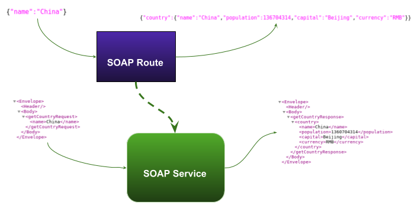

= SOAP To Rest
:toc: manual
:toc-placement: preamble

This demo if for demonstrating how to convert a exist SOAP Service to Rest Service as below:

The SOAP Service recieve SOAP Request with cuntry name, the SOAP response will reponse the whole conuntry information, once the SOAP service be convert to rest, the Rest Post method recieve a simple json with cuntry name, the REST return the completed country json.

== 本地运行

[source, bash]
----
$ cd agile-integration/fis-soap2rest
$ mvn clean package
$ java -jar target/fis-soaptorest-1.0.0-SNAPSHOT.jar
----

Use the following URL to test the new wrapped rest:

[source, bash]
----
$ curl -X GET  http://localhost:10000/rest/ping
Success!
$ curl -X POST  http://localhost:10000/rest/getCountry -H 'cache-control: no-cache' -H 'content-type: application/json' -d '{"name":"China"}'
{"country":{"name":"China","population":136704314,"capital":"Beijing","currency":"RMB"}}
----

== 部署到 OpenShift

[source, bash]
----
$ cd agile-integration/fis-soap2rest
$ mvn fabric8:deploy -Popenshift
----

Use the following URL to test the new wrapped rest:

[source, bash]
----
$ curl -X GET  http://soap2rest-integration-service.apps.example.com/rest/ping
Success!
$ curl -X POST  http://soap2rest-integration-service.apps.example.com/rest/getCountry -H 'cache-control: no-cache' -H 'content-type: application/json' -d '{"name":"China"}'
{"country":{"name":"China","population":136704314,"capital":"Beijing","currency":"RMB"}}
----

NOTE: DONOT forget to change the port mapping to make sure above test work success.
