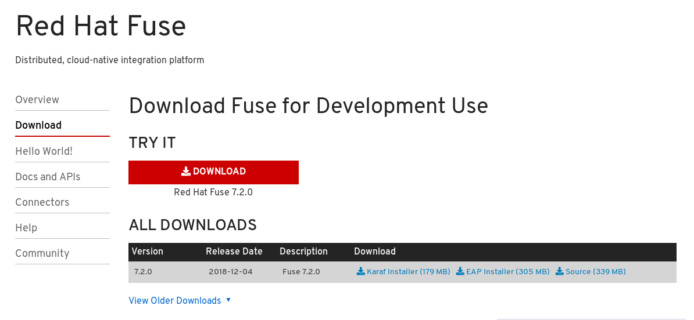
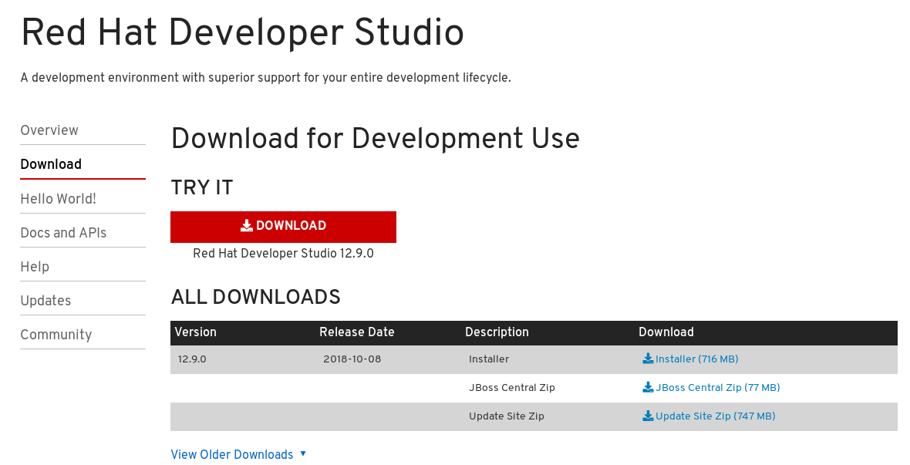
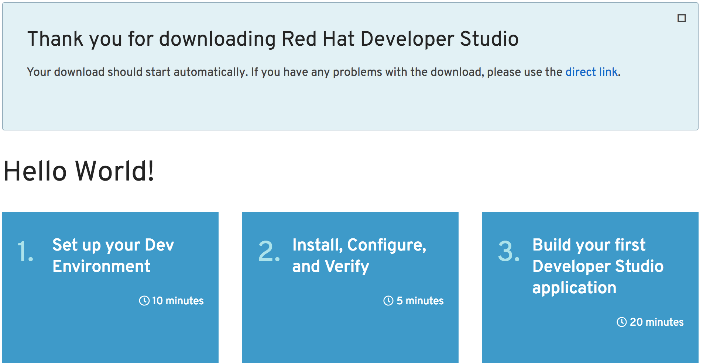
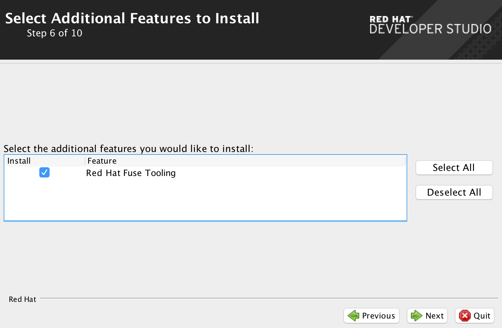

= 软件安装
:toc: manual

== Fuse on Karaf 

*1. 下载*

打开 https://developers.redhat.com/products/fuse/download/ 链接，点击红色 `DOWNLOAD` 按钮开始下载，

[source, text]
.*2. 解压完成安装*
----
$ unzip fuse-karaf-7.2.0.fuse-720035-redhat-00001.zip
----

[source, text]
.*3. 编辑 etc/users.properties，配置用户名/密码*
----
$ cd fuse-karaf-7.2.0.fuse-720035-redhat-00001/
$ vim etc/users.properties
admin = admin,_g_:admingroup
_g_\:admingroup = group,admin,manager,viewer,systembundles,ssh
----

== Developer Studio

*1. 下载*

打开 https://developers.redhat.com/products/devstudio/download/ 链接，点击红色 `DOWNLOAD` 按钮开始下载，

*2. 下载完成后会定向到如下页面，根据页面步骤完成安装*

*3. 在第 6 步选择 `Red Hat Fuse Tooling` 后点击 Next*

