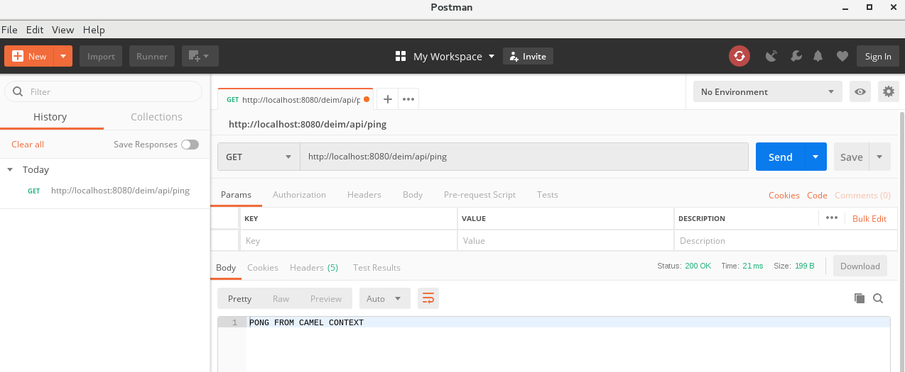

= 软件安装
:toc: manual

== Postman

*1. 下载*

打开 https://www.getpostman.com/downloads/ 下载。

[source, text]
.*2. 解压完成安装*
----
$ tar -xvf Postman-linux-x64-6.7.2.tar.gz
----

[source, text]
.*3. 运行*
----
$ cd Postman/
$ ./Postman
----

== Fuse on Karaf 

*1. 下载*

打开 https://developers.redhat.com/products/fuse/download/ 链接，点击红色 `DOWNLOAD` 按钮开始下载，

image:img/fuse-download.png[]

[source, text]
.*2. 解压完成安装*
----
$ unzip fuse-karaf-7.2.0.fuse-720035-redhat-00001.zip
----

[source, text]
.*3. 编辑 etc/users.properties，配置用户名/密码*
----
$ cd fuse-karaf-7.2.0.fuse-720035-redhat-00001/
$ vim etc/users.properties
admin = admin,_g_:admingroup
_g_\:admingroup = group,admin,manager,viewer,systembundles,ssh
----

== Developer Studio

*1. 下载*

打开 https://developers.redhat.com/products/devstudio/download/ 链接，点击红色 `DOWNLOAD` 按钮开始下载，

image:img/jbds-download.png[]

*2. 下载完成后会定向到如下页面，根据页面步骤完成安装*

image:img/jbds-setup.png[]

*3. 在第 6 步选择 `Red Hat Fuse Tooling` 后点击 Next*

image:img/jbds-tools.png[]

== JBoss Fuse 6.3

=== 组建明细

[cols="2,2,5a,2"]
|===
|类型 |安装包 |组件 | 依赖

|JBoss Fuse on Karaf
|jboss-fuse-karaf-6.3.0.redhat-187.zip
|
* Apache Camel
* SwitchYard
* Apache CXF
* Apache ActiveMQ
* Integration Pack
* JON Pack
|无

|JBoss Fuse on JBoss EAP
|fuse-eap-installer-6.3.0.redhat-187.jar
|
* Apache Camel
* SwitchYard
* BPEL/Riftsaw
* Integration Pack
* JON Pack
|JBoss EAP 6.4

|===

=== Fuse on Apache Karaf

[source, java]
.*JBoss Fuse 6.3 Install*
----
$ unzip jboss-fuse-karaf-6.3.0.redhat-187.zip && cd jboss-fuse-6.3.0.redhat-187
----

[source, java]
.*Edit etc/users.properties, comment out*
----
admin=admin,admin,manager,viewer,Monitor, Operator, Maintainer, Deployer, Auditor, Administrator, SuperUser
----

[source, java]
.*Start JBoss Fuse*
----
./bin/start
----

[source, java]
.*Edit etc/system.properties, change the AMQ default bind host*
----
activemq.host = 0.0.0.0
----

Login into http://localhost:8181/ with `admin`/`admin` for JBoss Fuse Management and runting monitor.

=== 安装常见 Feature

[source, java]
----
./bin/client
features:install camel-sql
features:install camel-jackson
features:install camel-http
features:install camel-jsonpath
features:install camel-jetty
features:install camel-xmljson
----

